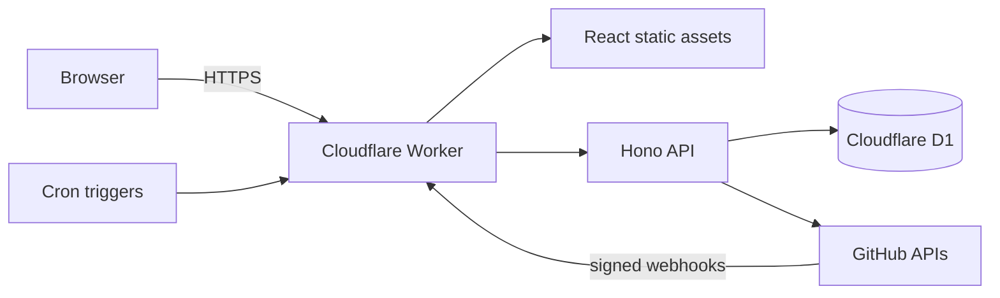

# RepoWrangler

**Wrangle every repository into one clear view.**

📖 **[Documentation](https://hybrid-solutions-cloud.github.io/repo-wrangler/)** · 🚀 **[Live demo](https://repo-wrangler.hybridsolutionscloud.workers.dev)**

RepoWrangler is an open-source repository estate dashboard. It automatically
discovers repositories across your GitHub organizations and GitLab groups,
continuously evaluates their operational health, and puts the work that needs
attention on one screen: failing pipelines, blocked and stale pull requests,
branches ahead of `main` with no PR, security findings, new and disappeared
repositories.

**Deploy anywhere. Own your data.** RepoWrangler is platform-neutral: the same app
runs on a laptop, a self-hosted Docker container, Kubernetes, Azure, or Cloudflare —
infrastructure is a swappable adapter, not a requirement. A **single Cloudflare
Worker + D1** on the free tier is the *reference* deployment (the simplest, cheapest
path), not a dependency — see [docs/design/platform-neutrality.md](docs/design/platform-neutrality.md)
and [docs/design/infrastructure-deployment.md](docs/design/infrastructure-deployment.md).
It is **read-only** toward your providers by design.

## Highlights

- **Automatic discovery** — install a read-only GitHub App with *All
  repositories* and new repos appear on the dashboard without configuration.
  Webhooks give near-real-time updates; checkpointed reconciliation repairs
  anything a missed webhook broke.
- **Attention-first** — the Command Center leads with what's wrong, ranked by
  severity, with an explanation for every finding. No opaque health scores.
- **Honest about missing data** — "0 budgets" and "budget API not authorized"
  are different states, and the UI never converts one into the other.
- **Branch intelligence** — `main is current` actually means something:
  ahead/behind/diverged comparison of active branches, with change-request
  tracking and bot-branch exclusions (FR-005 semantics).
- **Provider-neutral core** — the domain model knows workspaces, repositories,
  change requests, and pipelines; GitHub and GitLab are provider adapters.
- **Demo mode out of the box** — deploy with zero secrets and explore a
  synthetic estate evaluated by the real health rules engine.

## Quick start (demo mode, no secrets)

On Cloudflare's local runtime:

```bash
pnpm install
cp .dev.vars.example .dev.vars        # DEMO_MODE=true is the default
pnpm db:migrate:local
pnpm build
pnpm dev                              # http://localhost:8787
```

Or **self-hosted with zero Cloudflare** — the whole product on Node + SQLite in
one container:

```bash
docker compose up --build             # http://localhost:8080
```

See [`apps/server`](apps/server/README.md) and the
[`deploy/docker/`](deploy/docker/) recipe (topology **C — Self-hosted**).

## Documentation

Full documentation is in **[`docs/`](docs/README.md)** — start there. Highlights:

- [Getting started](docs/getting-started.md) · [Deployment guide](docs/deployment.md) (capability matrix + decision flowchart)
- [Configuration reference](docs/configuration.md) · [Architecture](docs/architecture.md) · [API reference](docs/api.md)
- Providers: [GitHub App](docs/providers/github-app.md) · [GitLab](docs/providers/gitlab.md) · [Entra ID sign-in](docs/providers/entra.md)
- [Operations](docs/operations.md) · [Security](docs/security.md) · [Developer guide](docs/developer.md) · [Troubleshooting](docs/troubleshooting.md)

## Deploying your own instance

The committed `wrangler.jsonc` ships **placeholders only** — it never carries a
real database id or your allowlist. Keep your instance-specific values out of the
repo so a `git pull` (or a Cloudflare Workers Build) can never wipe or leak them.

1. Create a D1 database:

   ```bash
   wrangler d1 create repo-wrangler
   ```

   Put the returned id in a **git-ignored** `wrangler.local.jsonc` (already in
   `.gitignore`) — or track it in your private ops repo — **not** in the
   committed `wrangler.jsonc`:

   ```jsonc
   // wrangler.local.jsonc — your values, never committed
   { "d1_databases": [ { "binding": "DB", "database_name": "repo-wrangler",
     "database_id": "<your-d1-database-id>", "migrations_dir": "migrations" } ] }
   ```

   Deploy with the override applied: `wrangler deploy -c wrangler.jsonc -c wrangler.local.jsonc`.
2. Apply migrations: `pnpm db:migrate:remote`
3. Create a **read-only GitHub App** and install it on your organizations (or
   your personal account) — see [docs/setup/github-app.md](docs/setup/github-app.md).
4. Set secrets (these live in Cloudflare, never in the repo):

   ```bash
   wrangler secret put GITHUB_APP_ID
   wrangler secret put GITHUB_APP_PRIVATE_KEY
   wrangler secret put GITHUB_WEBHOOK_SECRET
   wrangler secret put GITHUB_CLIENT_ID
   wrangler secret put GITHUB_CLIENT_SECRET
   wrangler secret put SESSION_SECRET
   wrangler secret put ALLOWED_GITHUB_USERS   # comma-separated; first user is the owner
   ```

   Setting `ALLOWED_GITHUB_USERS` as a **secret** (not a committed `var`) keeps
   your login out of the public repo and survives redeploys.
5. Set `PUBLIC_BASE_URL` and `DEMO_MODE=false` on your deployment, then `pnpm deploy`.

Full walkthrough: [docs/setup/deploy-cloudflare.md](docs/setup/deploy-cloudflare.md).
Hosting the UI somewhere other than Cloudflare (GitHub Pages, Azure Static Web
Apps, …)? See [docs/adr/ADR-011-host-agnostic-frontend.md](docs/adr/ADR-011-host-agnostic-frontend.md)
and the per-host recipes under [`deploy/`](deploy/).

## Architecture



- `apps/worker` — Hono API, GitHub App OAuth login, webhook receiver,
  Cron-driven checkpointed sync.
- `apps/web` — React + Vite SPA (Command Center, inventory, detail pages).
- `packages/domain` — provider-neutral entities, capability model, explainable
  health rules, branch semantics.
- `packages/provider-github` — App JWT, installation tokens, REST client,
  webhook translation, bounded collectors.
- `packages/provider-mock` — synthetic demo estate.
- `packages/persistence-d1` — schema, idempotent upserts, sync checkpoints.
- `packages/contracts` — shared API DTOs (zod).

The complete architecture, requirements, ADRs, and roadmap live in the
[solution design pack](docs/design/RepoWrangler-Solution-Design.md).

## Development

```bash
pnpm typecheck   # per-package strict TypeScript
pnpm test        # vitest — domain rules + webhook translation
pnpm build       # SPA production build
```

## License and credits

Apache License 2.0 — see [LICENSE](LICENSE) and [NOTICE](NOTICE).

RepoWrangler was inspired by
[GitactionBoard](https://github.com/otto-de/gitactionboard) (Apache-2.0) and
[Git Pull Request Dashboard](https://github.com/AKharytonchyk/git-pull-request-dashboard)
(MIT). No upstream source code has been copied; see
[THIRD_PARTY_NOTICES.md](THIRD_PARTY_NOTICES.md), [CREDITS.md](CREDITS.md),
and the in-product **About & Credits** page.
