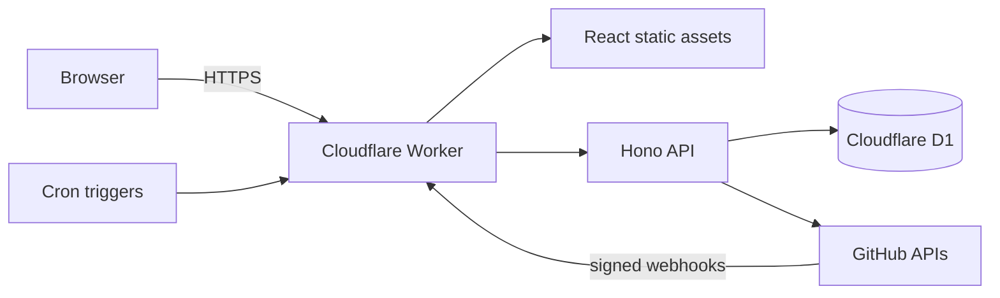

# RepoWrangler

**Wrangle every repository into one clear view.**

📖 **[Documentation](https://wranglerlabs.org/getting-started)** · 🚀 **[Live demo](https://repowrangler.dev)**

RepoWrangler is an open-source repository estate dashboard. It automatically
discovers repositories across your GitHub organizations and GitLab groups,
continuously evaluates their operational health, and puts the work that needs
attention on one screen: failing pipelines, blocked and stale pull requests,
branches ahead of `main` with no PR, security findings, new and disappeared
repositories.

**Deploy anywhere. Own your data.** RepoWrangler is platform-neutral: the same app
runs on a laptop, a self-hosted Docker container, Kubernetes, Azure, or Cloudflare —
infrastructure is a swappable adapter, not a requirement. A **single Cloudflare
Worker + D1** on the free tier is the *reference* deployment (the simplest, cheapest
path), not a dependency — see the [platform-neutrality](https://wranglerlabs.org/design/platform-neutrality)
and [infrastructure deployment](https://wranglerlabs.org/design/infrastructure-deployment) documentation.
It is **read-only** toward your providers by design.

## Choose how to deploy

RepoWrangler has one recommended guided path and one fully supported manual
alternative:

1. **Recommended: Ranch Hand Public Preview on Windows — no source clone.** The standalone
   [Ranch Hand](https://wranglerlabs.org/ranch-hand) application downloads
   and verifies immutable RepoWrangler release artifacts, builds a secret-free
   deployment plan, runs preflight/dry run, and applies a supported target. The
   current `v0.1.0-rc.5` build is a publicly downloadable, unsigned **Public
   Preview** with five distinct targets: local WSL Docker Compose, local Docker
   Desktop, remote Linux Docker Compose, Cloudflare, and Azure Container Apps.
   rc.5 adds visible WSL install progress, errors, and interrupted-operation
   recovery feedback alongside safe collision defaults and remote Linux field
   prepopulation. It is not a production-supported or GA release. Its public guide includes
   download, verification, prerequisites, workflow, limitations, and GA gates.
2. **Supported alternative: manual or user-owned automation.** Clone or fork the source, or consume immutable release artifacts. Use the
   commands below and the [`deploy/`](deploy/) recipes with Docker, Cloudflare,
   Azure Container Apps, Kubernetes, GitHub Actions, Azure DevOps, or your own
   tooling. This path remains fully supported and is also the contributor path.

The RepoWrangler `v1.0.10` release page contains server images and deployment
bundles consumed by Ranch Hand or user-owned automation. It does **not** contain
a Windows executable; Ranch Hand is released separately from its own repository.

## Highlights

- **Automatic discovery** — install a read-only GitHub App with *All
  repositories* and new repos appear on the dashboard without configuration.
  Webhooks give near-real-time updates; checkpointed reconciliation repairs
  anything a missed webhook broke.
- **Attention-first** — the Command Center leads with what's wrong, ranked by
  severity, with an explanation for every finding. No opaque health scores.
- **Honest about missing data** — "0 budgets" and "budget API not authorized"
  are different states, and the UI never converts one into the other.
- **Branch intelligence** — `main is current` actually means something:
  ahead/behind/diverged comparison of active branches, with change-request
  tracking and bot-branch exclusions (FR-005 semantics).
- **Provider-neutral core** — the domain model knows workspaces, repositories,
  change requests, and pipelines; GitHub and GitLab are provider adapters.
- **Demo mode out of the box** — deploy with zero secrets and explore a
  synthetic estate evaluated by the real health rules engine.

## Manual quick start (demo mode, no secrets)

On Cloudflare's local runtime:

```bash
pnpm install
cp .dev.vars.example .dev.vars        # DEMO_MODE=true is the default
pnpm db:migrate:local
pnpm build
pnpm dev                              # http://localhost:8787
```

Or **self-hosted with zero Cloudflare** — the whole product on Node + SQLite in
one container:

```bash
docker compose up --build             # http://localhost:8080
```

See [`apps/server`](apps/server/README.md) and the
[`deploy/docker/`](deploy/docker/) recipe (topology **C — Self-hosted**).

## Documentation

Full documentation is maintained at **[wranglerlabs.org](https://wranglerlabs.org/getting-started)**. Highlights:

- [Getting started](https://wranglerlabs.org/getting-started) · [Deployment guide](https://wranglerlabs.org/deployment)
- [Configuration reference](https://wranglerlabs.org/configuration) · [Architecture](https://wranglerlabs.org/architecture) · [API reference](https://wranglerlabs.org/api)
- Providers: [GitHub App](https://wranglerlabs.org/providers/github-app) · [GitLab](https://wranglerlabs.org/providers/gitlab) · [Entra ID](https://wranglerlabs.org/providers/entra)
- [Operations](https://wranglerlabs.org/operations) · [Security](https://wranglerlabs.org/security) · [Developer guide](https://wranglerlabs.org/developer) · [Troubleshooting](https://wranglerlabs.org/troubleshooting)

## Deploying your own instance

This section is the manual Cloudflare alternative for contributors, custom
automation, production topologies outside Ranch Hand's preview boundary, or
operators who prefer to own the commands.

The committed `wrangler.jsonc` ships **placeholders only** — it never carries a
real database id or your allowlist. Keep your instance-specific values out of the
repo so a `git pull` (or a Cloudflare Workers Build) can never wipe or leak them.

1. Create a D1 database:

   ```bash
   wrangler d1 create repo-wrangler
   ```

   Put the returned id in a **git-ignored** `wrangler.local.jsonc` (already in
   `.gitignore`) — or track it in your private ops repo — **not** in the
   committed `wrangler.jsonc`:

   ```jsonc
   // wrangler.local.jsonc — your values, never committed
   { "d1_databases": [ { "binding": "DB", "database_name": "repo-wrangler",
     "database_id": "<your-d1-database-id>", "migrations_dir": "migrations" } ] }
   ```

   Deploy with the override applied: `wrangler deploy -c wrangler.jsonc -c wrangler.local.jsonc`.
2. Apply migrations: `pnpm db:migrate:remote`
3. Set the first-boot infrastructure secrets (these live in Cloudflare, never
   in the repo):

   ```bash
   wrangler secret put SESSION_SECRET
   wrangler secret put SECRET_ENCRYPTION_KEY
   wrangler secret put SETUP_TOKEN # optional; recommended for internet-facing first boot
   ```

4. Set `PUBLIC_BASE_URL` and `DEMO_MODE=false`, then deploy and open the app. The
   first-run wizard creates or connects the read-only GitHub App, stores its
   credentials encrypted, and asks which organizations to monitor. Setup access
   closes permanently when normal sign-in becomes usable.
5. Pre-seeded GitOps remains supported: set the five `GITHUB_*` values and
   `ALLOWED_GITHUB_USERS` before switching to real mode instead of using the wizard.

Full walkthrough: [Deploy to Cloudflare](https://wranglerlabs.org/setup/deploy-cloudflare).
Hosting the UI somewhere other than Cloudflare (GitHub Pages, Azure Static Web
Apps, …)? See [ADR-011](https://wranglerlabs.org/adr/ADR-011-host-agnostic-frontend)
and the per-host recipes under [`deploy/`](deploy/).

## Architecture



- `apps/worker` — Hono API, GitHub App OAuth login, webhook receiver,
  Cron-driven checkpointed sync.
- `apps/web` — React + Vite SPA (Command Center, inventory, detail pages).
- `packages/domain` — provider-neutral entities, capability model, explainable
  health rules, branch semantics.
- `packages/provider-github` — App JWT, installation tokens, REST client,
  webhook translation, bounded collectors.
- `packages/provider-mock` — synthetic demo estate.
- `packages/persistence-d1` — schema, idempotent upserts, sync checkpoints.
- `packages/contracts` — shared API DTOs (zod).

The complete architecture, requirements, ADRs, and roadmap live in the
[solution design pack](https://wranglerlabs.org/design/RepoWrangler-Solution-Design).

## Development

```bash
pnpm typecheck   # per-package strict TypeScript
pnpm test        # vitest — domain rules + webhook translation
pnpm build       # SPA production build
```

## Releases and support

Production instances should use immutable semantic-version tags. See the
[upgrade and rollback policy](UPGRADING.md), [support expectations](SUPPORT.md),
[security policy](SECURITY.md), and [changelog](CHANGELOG.md). Support is
best-effort; operators own their deployment, credentials, backups, and recovery.

## License and credits

Apache License 2.0 — see [LICENSE](LICENSE) and [NOTICE](NOTICE).

RepoWrangler was inspired by
[GitactionBoard](https://github.com/otto-de/gitactionboard) (Apache-2.0) and
[Git Pull Request Dashboard](https://github.com/AKharytonchyk/git-pull-request-dashboard)
(MIT). No upstream source code has been copied; see
[THIRD_PARTY_NOTICES.md](THIRD_PARTY_NOTICES.md), [CREDITS.md](CREDITS.md),
and the in-product **About & Credits** page.
