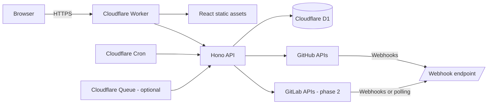
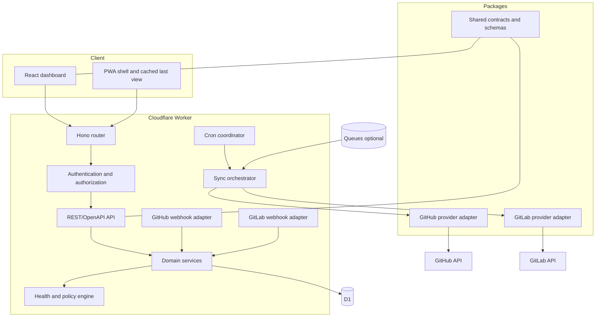
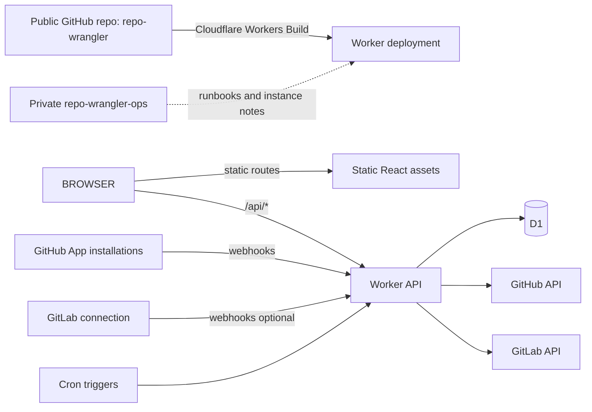
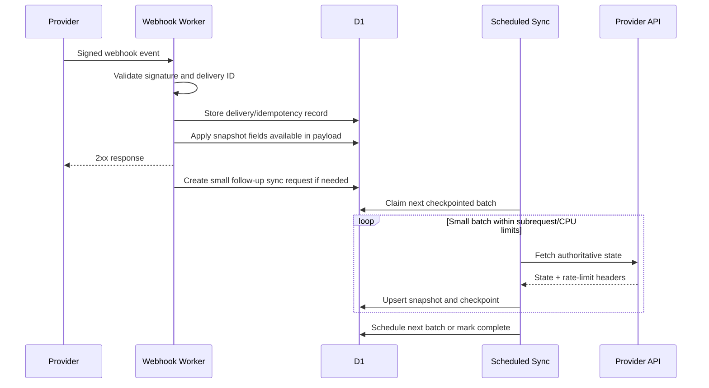
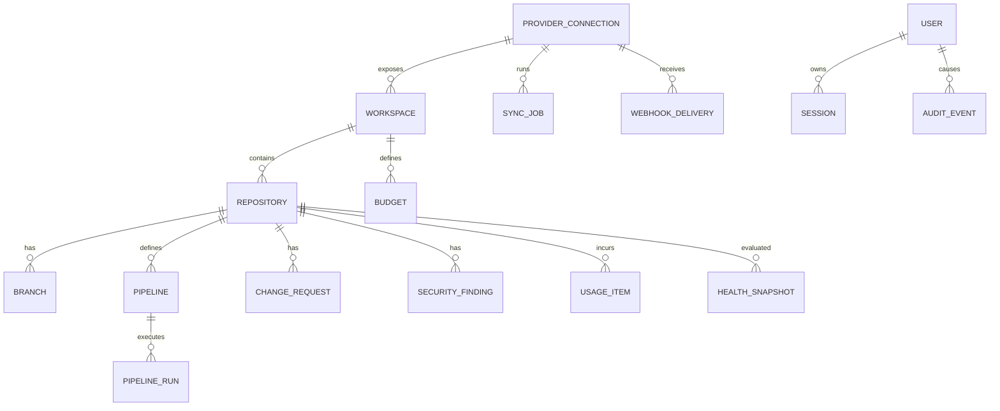
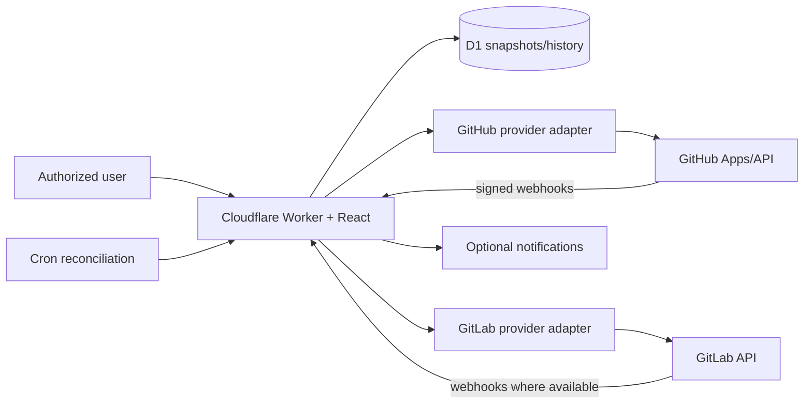

# RepoWrangler — Complete Documented Solution

Prepared 2026-07-11. This combined document is generated from the split design pack.


---

# Executive Summary

## Product name

**RepoWrangler**

### Product statement

RepoWrangler is an open-source repository estate dashboard that automatically discovers repositories across multiple source-control organizations and groups, continuously evaluates their operational health, and presents the work requiring attention in one place.

### Suggested tagline

**Wrangle every repository into one clear view.**

## Problem being solved

A user who belongs to many GitHub organizations—and later GitLab groups—cannot easily answer basic estate-level questions without opening each organization and repository separately:

- What organizations and repositories exist right now?
- Was a new repository created without being added to a monitoring list?
- Which repositories have failed GitHub Actions or GitLab pipelines?
- Which pull requests or merge requests are blocked, stale, conflicted, awaiting review, or ready to merge?
- Which branches contain work not merged into the default branch?
- Is `main` actually current, and what does “current” mean?
- Which repositories lack branch protection, rulesets, security controls, ownership metadata, or expected files?
- Which budgets exist, what scopes do they cover, and how much usage has accumulated?
- Which repositories have gone inactive, become abandoned, or should be archived?

RepoWrangler answers these questions with a cross-provider command center and drill-down pages.

## Primary goals

1. **Automatic discovery:** New GitHub repositories should appear automatically when the GitHub App is installed for all repositories. GitLab projects should be found through group discovery and periodic reconciliation.
2. **Attention-first operations:** The first screen should prioritize failures, stale work, security findings, policy drift, and cost warnings—not merely list repositories.
3. **Provider-neutral expansion:** GitHub is the first provider; GitLab is a planned first-class provider rather than an afterthought.
4. **Free-first hosting:** The normal personal deployment should fit Cloudflare's free tier whenever repository count and activity permit.
5. **Open-source by default:** All reusable application code and documentation should be public. Personal data, credentials, and instance policy remain private.
6. **Read-only by default:** Monitoring launches with the smallest practical permissions. Remediation actions are later, optional, explicit, and auditable.
7. **Modern front end:** Responsive React/TypeScript, accessible components, dark/light themes, PWA readiness, fast navigation, powerful filtering, and a provider-neutral design system.
8. **Traceable reuse:** Any code or substantial design reused from upstream projects must be recorded in source comments, notices, machine-readable credits, and an in-product credits page.

## Non-goals for the first release

- A multi-tenant commercial SaaS control plane.
- Replacing GitHub, GitLab, Backstage, or a full developer portal.
- Mirroring source code or storing repository contents.
- Automatically merging, deleting branches, changing protections, or modifying budgets.
- Running heavyweight analytics or long-lived ETL jobs inside one free-tier Worker invocation.
- Perfect historical reporting from day one.

## Recommended deployment



Cloudflare's current React guidance supports a full-stack React SPA, Worker API, and Vite plugin in one project. Static SPA routes can be served without invoking Worker code, which preserves the free request allowance.

## Repository decision

Use two repositories only when they serve distinct purposes:

### Public product repository

`Hybrid-Solutions-Cloud/repo-wrangler`

Contains the entire application, tests, schemas, migrations, public documentation, deployment templates, issue templates, ADRs, credits, and releases.

### Private operations repository

`Hybrid-Solutions-Cloud/repo-wrangler-ops`

Contains your private operating notes and policy—but not the application source and not secrets. The live deployment may be built directly from the public repository. The private repo is therefore optional and never blocks community users from deploying the software.

## Key architectural constraint

The Cloudflare Workers Free plan currently allows 100,000 dynamic requests per day, 50 subrequests per invocation, five Cron Triggers per account, and 10 ms CPU time per Worker or Cron invocation. Waiting on network calls does not count as CPU, but parsing and processing do. The collector must therefore:

- prefer webhook payloads over polling;
- use GraphQL or batched REST calls where useful;
- checkpoint all scans;
- refresh only a small number of repositories per invocation;
- avoid comparing every branch on every scan;
- compact history;
- expose its own quota and sync-health dashboard;
- degrade gracefully when a capability is unavailable.

## Success criteria for the first usable release

A successful GitHub MVP will:

- connect a GitHub App;
- enumerate all installations, organizations, and accessible repositories;
- automatically add new repositories;
- display default branch, latest activity, visibility, archived status, and topics;
- show latest Actions/check status;
- show open PR counts and attention states;
- identify active branches ahead/behind/diverged from the default branch;
- display budget records and usage when GitHub exposes them and the app is authorized;
- clearly distinguish **none configured**, **not authorized**, **unsupported**, and **temporarily unavailable**;
- run on a free Cloudflare account under normal personal usage;
- include a public credits page and compliant third-party notices.


---

# Product Requirements

## Personas

### Estate owner

A person who owns or administers many GitHub organizations and GitLab groups. They need an immediate view of what is healthy, broken, stale, unprotected, or costing money.

### Repository maintainer

A maintainer who needs a focused view of repositories they own, PRs/MRs requiring attention, failed pipelines, stale branches, and policy drift.

### Read-only observer

A family member, colleague, client, or community user who can view a curated dashboard without receiving provider credentials or organization administrator rights.

### Open-source operator

A person who deploys RepoWrangler for their own estate. They need setup guidance, a GitHub App manifest, migrations, upgrade instructions, and a safe way to keep instance configuration private.

## Core terminology

RepoWrangler uses provider-neutral terms in its domain model while preserving provider-specific labels in the interface.

| Neutral term | GitHub | GitLab |
|---|---|---|
| Provider | GitHub | GitLab.com or self-managed GitLab |
| Workspace | Organization or user account | Group or namespace |
| Repository | Repository | Project |
| Change request | Pull request | Merge request |
| Pipeline | Actions workflow/check suite | CI/CD pipeline |
| Default branch | Default branch | Default branch |
| Security finding | Dependabot/code/secret alert | Vulnerability/security finding |

## Functional requirements

### FR-001 Provider connections

- Connect one or more GitHub App installations.
- Support organizations and personal-account repositories exposed to the installation.
- Add GitLab connections later through OAuth or a read-only access token.
- Display connection health, last successful API call, current rate-limit information, and missing permissions.

### FR-002 Automatic workspace and repository discovery

- Discover all repositories accessible to a GitHub App installation.
- When installed with **All repositories**, process `installation`, `installation_repositories`, and `repository` events so new repositories appear without manual configuration.
- Run periodic reconciliation to recover from missed webhooks or changed access.
- Support include/exclude rules by provider, workspace, repository topic, visibility, archived state, and name pattern.
- Do not silently delete disappeared repositories; mark them inaccessible or removed and retain an audit trail.

### FR-003 Estate overview

The home dashboard must show:

- connected providers;
- workspaces and repositories;
- repositories requiring attention;
- failed or cancelled pipelines;
- open, stale, conflicted, blocked, and ready-to-merge PRs/MRs;
- branches ahead of or diverged from the default branch;
- security findings;
- repositories with missing governance controls;
- budget and usage warnings;
- newly discovered repositories;
- inactive repositories;
- synchronization or authorization problems.

### FR-004 Repository inventory

Each repository record should include at least:

- provider, workspace, repository name, URL, description, visibility, archived state, fork state;
- default branch;
- latest push and latest provider activity;
- language, topics, license, and repository size when available;
- ownership/team metadata when available;
- enabled features such as issues, wiki, Actions/CI, packages, and security scanning;
- monitoring state and capability state.

### FR-005 Branch intelligence

RepoWrangler must not reduce branch health to “which commit timestamp is newest.” It should separately present:

- the default branch;
- the most recently updated branch;
- each active branch's `ahead`, `behind`, `identical`, or `diverged` relationship to the default branch;
- branches containing unmerged commits;
- whether an open PR/MR exists;
- the age of the most recent commit;
- branch protection and matching rulesets;
- configurable exclusions for release, dependency-bot, generated, and long-lived branches.

Default branch status labels:

- **Current:** no non-excluded active branch is ahead without an accepted explanation.
- **Work pending:** one or more branches are ahead and have an open change request.
- **Untracked work:** one or more branches are ahead without a change request.
- **Diverged:** a branch is both ahead and behind.
- **Unknown:** comparison could not be performed due to permissions, rate limit, or provider capability.

### FR-006 Pipelines and actions

- Show latest status for each workflow/pipeline and default-branch run.
- Show failing, cancelled, timed-out, skipped, queued, and long-running states.
- Show the failing job and step when obtainable without downloading all logs.
- Link directly to the provider run.
- Preserve a configurable amount of historical run data.
- Later: provide an opt-in action to rerun failed jobs using a separate write-enabled connection.

### FR-007 Pull requests and merge requests

- Open, draft, ready, blocked, conflicted, awaiting review, approved, stale, and mergeable states.
- Requested reviewers and review age.
- CI/check status.
- Base/head branch relationship.
- Recently merged changes.
- Saved views such as “waiting on me,” “ready to merge,” and “failed checks.”

### FR-008 Budgets and usage

For GitHub organizations where the authenticated principal is authorized:

- enumerate custom budgets;
- identify scope, product/SKU, amount, stop-usage behavior, alert state, and recipients when returned;
- display no-budget conditions separately from authorization failures;
- retrieve organization usage when the enhanced billing platform exposes it;
- map usage to repository when the response includes repository identity;
- calculate percent used and simple projection with a clear “estimate” label;
- store daily snapshots rather than every raw usage line indefinitely.

For providers or plans without equivalent budget APIs, display the capability as unsupported rather than zero.

### FR-009 Governance

Evaluate optional policy checks:

- default branch protection or rulesets;
- required reviews and status checks;
- `CODEOWNERS`, `SECURITY.md`, `CONTRIBUTING.md`, license, and README presence;
- issue and PR templates;
- dependency update configuration;
- expected topics/custom properties;
- signed commits or required linear history when available;
- stale repository and archival candidates.

Policy must be configurable per workspace and repository classification. A personal demo repo should not be judged by the same policy as a production service.

### FR-010 Security findings

When enabled and authorized:

- code scanning alerts;
- secret scanning alerts;
- dependency alerts;
- GitLab vulnerability findings later;
- severity, age, state, repository, branch/ref, and direct link;
- counts on overview screens without exposing secret content.

### FR-011 Notifications

Initial release:

- in-app attention queue;
- browser notification eligibility/PWA groundwork;
- configurable outbound generic webhook.

Future connectors:

- Microsoft Teams;
- Slack;
- Discord;
- email;
- GitHub issue creation;
- web push.

Notification deduplication, quiet hours, acknowledgement, and escalation rules should be part of the model even if implemented later.

### FR-012 Search, filters, and saved views

Users must be able to filter by:

- provider, workspace, owner, repository, visibility, archived state;
- health/attention status;
- pipeline status;
- branch status;
- PR/MR state;
- security severity;
- budget state;
- last activity;
- language/topic/custom property.

Saved views should be serializable and optionally shareable inside the same instance.

### FR-013 Repository detail

Each repository page should include tabs for:

1. Overview
2. Branches
3. Pipelines/Actions
4. Pull requests/Merge requests
5. Security
6. Governance
7. Cost and budgets
8. Activity and sync history
9. Provider capabilities

### FR-014 Export and portability

- Export inventory and current health to JSON and CSV.
- Export a human-readable Markdown report.
- Provide database migration and backup procedures.
- Avoid storing provider tokens in exports.
- Future: provider-neutral API and MCP server.

### FR-015 Administration

- Provider connection setup.
- Workspace include/exclude policy.
- Repository classifications and tags.
- Retention settings.
- Health policy and thresholds.
- User allowlist/roles.
- Manual reconciliation and repository refresh.
- Usage/limit dashboard.
- Credits and license information.

## Non-functional requirements

### NFR-001 Security

Read-only by default, least privilege, validated webhooks, encrypted platform secrets, secure sessions, CSRF protection, content security policy, audit events, dependency scanning, and token redaction.

### NFR-002 Performance

- Initial dashboard should render from D1 snapshots rather than waiting on provider APIs.
- Static assets should be served without Worker invocation where possible.
- Large tables must virtualize rows.
- API endpoints use pagination and indexed queries.

### NFR-003 Reliability

- Webhook handlers are idempotent by delivery ID.
- Polling/reconciliation is resumable.
- Failures do not erase last-known-good data.
- Capability and freshness timestamps are visible.

### NFR-004 Accessibility

Target WCAG 2.2 AA, full keyboard navigation, semantic status indicators not dependent on color alone, reduced-motion support, and accessible charts/tables.

### NFR-005 Maintainability

Strict TypeScript, provider interfaces, isolated domain logic, documented schemas, automated tests, ADRs, conventional commits, semantic releases, and dependency automation.

### NFR-006 Open-source compliance

Apache-2.0 project license, third-party license inventory, generated credits page, preserved notices, source-level provenance for copied files/functions, and automated checks in CI.

### NFR-007 Cost awareness

The application monitors its own Cloudflare and provider usage where possible, applies hard batch limits, and stops nonessential historical collection before exceeding free-tier capacity.


---

# Solution Architecture

## Architecture style

RepoWrangler should use a lightweight hexagonal architecture inside a single repository:

- **Domain core:** provider-neutral entities, health rules, capability model, and use cases.
- **Provider adapters:** GitHub and GitLab clients, event translators, and capability implementations.
- **Persistence adapter:** D1 repositories and migrations.
- **Delivery adapters:** HTTP API, webhook endpoints, Cron handler, optional Queue consumer, and React UI.
- **Infrastructure:** Cloudflare Worker, static assets, D1, secret bindings, and optional Queue.

This preserves a simple deployment while preventing GitHub-specific response shapes from becoming the application's permanent data model.

## Logical components



## Deployment topology

One deployable Cloudflare Worker serves both the API and static assets.



The private operations repo is outside the build path unless the owner later chooses to automate environment-specific smoke tests from it.

## Request routing

- `/`, `/repositories/*`, `/workspaces/*`, `/settings/*`: static SPA assets or SPA fallback.
- `/api/v1/*`: authenticated JSON API.
- `/auth/github/*`: user login flow.
- `/webhooks/github`: GitHub App webhook receiver.
- `/webhooks/gitlab/:connectionId`: GitLab webhook receiver.
- `/internal/scheduled`: not publicly routable; invoked by Cron handler.
- `/health/live`: minimal liveness response.
- `/health/ready`: checks D1 and migrations without calling providers.

## Event-driven plus reconciliation model

Webhooks are fast and cheap but not perfect. Polling is authoritative but expensive. RepoWrangler uses both.



## Provider capability model

Every provider adapter reports capabilities at connection, workspace, and repository level:

```text
available
not_configured
not_authorized
unsupported_by_provider
unsupported_by_plan
temporarily_unavailable
rate_limited
error
```

The UI must never convert missing data into a false zero. For example, “0 budgets” is different from “budget API unavailable.”

## Synchronization classes

### Class A: event-updated

Updated primarily from webhooks:

- repository creation/rename/archive;
- pushes and branch creation/deletion;
- workflow and pipeline status;
- PR/MR state;
- security alert state;
- ruleset/protection changes.

### Class B: periodic lightweight

- installation/workspace/repository inventory;
- default branch metadata;
- open PR/MR summary;
- latest run summary;
- connection health.

### Class C: periodic expensive

- active branch comparisons;
- detailed governance evaluation;
- budgets and usage;
- historical analytics;
- security inventory reconciliation.

Expensive work runs less frequently and in checkpointed batches.

## Branch comparison strategy

1. Process branch-related webhooks immediately.
2. Track branches active within a configurable period, default 90 days.
3. Prioritize branches referenced by open PRs/MRs.
4. Compare only a bounded number per repository per cycle.
5. Record `ahead_by`, `behind_by`, status, comparison time, and source SHA.
6. Mark data stale rather than repeatedly polling inactive branches.
7. Exclude configured patterns such as `dependabot/**`, `renovate/**`, `release/**`, and generated branches.

## Data freshness targets

| Data | Desired freshness | Mechanism |
|---|---:|---|
| New repository | Near real-time | GitHub installation/repository webhook |
| Workflow/pipeline status | Near real-time | Workflow/pipeline webhook |
| PR/MR status | Near real-time | Change-request webhook |
| Repository inventory | Several hours | Reconciliation |
| Active branch comparison | Event-driven plus daily catch-up | Push + batch comparison |
| Security alerts | Event-driven plus daily | Alert webhook + reconciliation |
| Budgets/usage | Daily | Billing sync |
| Governance | Daily or after relevant events | Policy evaluation |

These are product targets, not guarantees. Every record includes `observed_at`, `provider_updated_at`, and `last_successful_sync_at` where appropriate.

## Portability

Cloudflare is the first hosting target, but core packages must not import Cloudflare types directly. Infrastructure-specific code belongs in adapters. This allows later targets such as Node.js with PostgreSQL, Azure Functions, a container, or local SQLite without replacing the React application or provider logic.


---

# Platform Requirements

## GitHub requirements

### GitHub organization

Primary project organization:

`https://github.com/Hybrid-Solutions-Cloud`

Recommended repositories:

- `repo-wrangler` — public product repo.
- `repo-wrangler-ops` — private personal operations repo.
- temporary public forks of the two upstream projects.

### GitHub App

Create a GitHub App owned by `Hybrid-Solutions-Cloud`.

Recommended names:

- Development: `RepoWrangler Dev`
- Production/personal: `RepoWrangler`

The open-source project should provide a GitHub App manifest/template, but each operator creates their own app and owns their own credentials.

### Installation scope

For automatic discovery, install the App on each organization using **All repositories**. GitHub exposes an All repositories or selected repositories choice during installation. The design must still support selected-repository installations, but the UI should warn that new repositories will not automatically become accessible until the installation selection changes.

### Candidate repository permissions

Final names and availability must be validated in a research spike because GitHub adjusts permission labels and endpoint requirements. The intended read-only permission set is:

| Permission area | Level | Purpose |
|---|---|---|
| Metadata | Read | Basic repository identity; mandatory for apps. |
| Contents | Read | Branch refs, commits, repository files used for governance checks. |
| Actions | Read | Workflows, runs, jobs, and artifacts metadata. |
| Checks | Read | Check runs and check suites. |
| Commit statuses | Read | Legacy and external CI statuses. |
| Pull requests | Read | PR state, reviews, mergeability, and branches. |
| Administration (repository) | Read | Branch protection, repository settings, and rulesets where supported. |
| Deployments | Read | Optional deployment and environment status. |
| Issues | Read | Optional issue health and issue-based notifications. |
| Code scanning alerts | Read | Optional security dashboard. |
| Dependabot alerts | Read | Optional dependency findings. |
| Secret scanning alerts | Read | Optional secret findings. |
| Members (organization) | Read | Optional ownership and authorization policy. |
| Administration (organization) | Read | Organization budgets and billing usage endpoints where authorized. |
| Custom properties | Read | Optional governance/classification metadata. |

Do not request write permissions in the initial GitHub App. A later remediation mode should use a separate app or explicit optional permission upgrade.

### Candidate GitHub webhooks

- `installation`
- `installation_repositories`
- `repository`
- `push`
- `create`
- `delete`
- `pull_request`
- `pull_request_review`
- `workflow_run`
- `workflow_job`
- `check_run`
- `check_suite`
- `status`
- `branch_protection_configuration`
- `branch_protection_rule`
- `repository_ruleset`
- `code_scanning_alert`
- `dependabot_alert`
- `secret_scanning_alert`
- `deployment`
- `deployment_status`
- `release`

Only subscribe to events the application handles. GitHub recommends limiting subscriptions to reduce unnecessary webhook traffic.

### GitHub authentication modes

1. **App JWT:** used only to manage App-level operations and exchange for installation tokens.
2. **Installation access token:** short-lived token used for repository and organization data.
3. **User access token from the GitHub App OAuth flow:** used for dashboard login and user-context endpoints such as personal billing when enabled.

Private key and webhook secret are stored as Cloudflare secrets, never in GitHub, D1, logs, or the ops repo.

### GitHub billing caveats

- Organization budget endpoints require an organization admin or billing manager and organization Administration read permission.
- Usage reporting is available only for organizations with access to GitHub's enhanced billing platform.
- Some user billing endpoints use user-level Plan read permission.
- RepoWrangler must show capability/authorization state instead of assuming every organization supports the same billing data.

## Cloudflare requirements

### Minimum services

| Service | Required | Free-first purpose |
|---|---:|---|
| Workers | Yes | API, webhooks, auth, Cron handler, and static asset routing. |
| Workers Static Assets | Yes | React SPA without dynamic invocation on matched static routes. |
| D1 | Yes | Inventory, snapshots, sync state, sessions/audit metadata, history. |
| Workers Builds | Recommended | Automatic build/deploy from public GitHub repo. |
| Cron Triggers | Yes | Reconciliation, billing, governance, and compaction. |
| Workers Secrets | Yes | Provider and session secrets. |
| Queues | Optional | Retryable follow-up jobs and webhook buffering after feasibility spike. |
| Access | Optional | Additional login gate in front of the Worker. |
| Custom domain | Optional | Use `workers.dev` at no domain cost initially. |

### Cloudflare bindings

Expected `wrangler.jsonc` bindings:

```jsonc
{
  "name": "repo-wrangler",
  "main": "apps/worker/src/index.ts",
  "compatibility_date": "<current implementation date>",
  "assets": {
    "directory": "apps/web/dist",
    "not_found_handling": "single-page-application"
  },
  "d1_databases": [
    {
      "binding": "DB",
      "database_name": "repo-wrangler",
      "database_id": "<operator-created-id>"
    }
  ],
  "triggers": {
    "crons": ["*/15 * * * *", "17 3 * * *"]
  }
}
```

The final Cron schedule may use fewer triggers and dispatch different job types based on the current time to stay below the free account limit of five triggers.

### Required Cloudflare secrets

```text
GITHUB_APP_ID
GITHUB_APP_PRIVATE_KEY
GITHUB_WEBHOOK_SECRET
GITHUB_CLIENT_ID
GITHUB_CLIENT_SECRET
SESSION_SECRET
```

GitLab phase:

```text
GITLAB_CLIENT_ID
GITLAB_CLIENT_SECRET
GITLAB_WEBHOOK_SECRET_<connection>
```

A personal access token may be supported for initial GitLab testing but OAuth is preferred for a shareable open-source solution.

### Non-secret configuration

```text
PUBLIC_BASE_URL
AUTH_MODE=github_app
ALLOWED_GITHUB_USERS
ALLOWED_GITHUB_ORGS
DEFAULT_RETENTION_DAYS
ENABLE_GITLAB
ENABLE_SECURITY_FEATURES
ENABLE_BILLING_FEATURES
```

Prefer storing mutable policy in D1 through the admin UI rather than adding dozens of environment variables.

## GitLab requirements

### Supported targets

- GitLab.com
- GitLab Self-Managed with configurable base URL
- GitLab Dedicated where the standard API is available

### Discovery

The GitLab Groups API is available across Free, Premium, and Ultimate and can list projects within groups, including subgroups when requested. RepoWrangler should periodically enumerate configured top-level groups and compare the result with its local inventory.

### Candidate GitLab capabilities

- groups and projects;
- branches and compare results;
- merge requests and approvals;
- pipelines, jobs, and statuses;
- project hooks where permitted;
- protected branches;
- releases and tags;
- project statistics and storage where authorized;
- security/vulnerability data when plan and permissions allow.

### GitLab authentication

Preferred order:

1. OAuth application with `read_api` or the smallest sufficient scopes.
2. Project/group access token where the operator's plan supports it.
3. Personal access token for development and personal deployments.

Tokens are per connection and stored only as Cloudflare secrets or encrypted through a future secret broker. D1 stores connection metadata and a secret reference, never the token value.

### GitLab webhook reality

Webhook and group-level capabilities vary by offering, plan, and role. GitLab integration must always retain scheduled discovery and reconciliation as the source of truth. Webhooks are an optimization, not a dependency.

## Lucid requirements

Lucid is not required at runtime. It is a documentation and collaboration option.

RepoWrangler documentation should keep Mermaid source diagrams in Git so diagrams remain reviewable and versioned. Important architecture diagrams can also be recreated in Lucidchart for workshops, presentations, and stakeholder review. The Lucid document should link back to the ADR or Markdown source and state whether Mermaid or Lucid is authoritative.


---

# Free-Tier Capacity and Cost Design

## Objective

Run a personal RepoWrangler deployment for as close to **$0/month** as practical, without hiding the conditions that may eventually require a paid plan.

## Verified Cloudflare free allowances at planning time

| Capability | Free allowance relevant to RepoWrangler |
|---|---:|
| Workers requests | 100,000 dynamic requests/day |
| Worker CPU | 10 ms CPU per HTTP or Cron invocation |
| Subrequests | 50 per invocation |
| Cron triggers | 5 per account |
| Static asset requests | Free and unlimited when served as static assets |
| D1 rows read | 5 million/day |
| D1 rows written | 100,000/day |
| D1 storage | 5 GB total |
| Queues | 10,000 operations/day, 24-hour retention |
| Workers Builds | 3,000 build minutes/month, one concurrent build |

Cloudflare pricing and limits can change. RepoWrangler must record the assumptions in documentation and expose configurable guardrails rather than hard-code provider quotas.

## Other expected costs

| Item | Expected initial cost |
|---|---:|
| Public GitHub repository | $0 |
| GitHub App registration/installations | $0 |
| GitHub API usage within rate limits | $0 |
| GitLab API | $0, subject to account plan and rate limits |
| Cloudflare Worker/D1/Builds | $0 while within free limits |
| `workers.dev` hostname | $0 |
| Custom domain | Existing domain or annual registration cost |
| Optional paid Workers plan | Currently starts at $5/month if free CPU/request limits become restrictive |

## Why the design can fit the free tier

### Static-first UI

Most browser requests are for JavaScript, CSS, fonts, and route assets. The Cloudflare React SPA configuration should serve those as static assets rather than invoking Worker code.

### Snapshot reads instead of live fan-out

Dashboard pages read from indexed D1 snapshots. They do not call 15 organizations and hundreds of repositories during a page request.

### Webhook-first updates

Provider webhooks update or invalidate the exact repository that changed. RepoWrangler does not repeatedly poll every repository for workflow and PR status.

### Small reconciliation batches

A scheduled invocation claims a bounded batch and records a cursor. It never attempts the full estate in a single execution.

### Tiered freshness

Failures and PR changes are fast; budgets and policy checks can be daily. Inactive branches do not need continuous comparison.

## Capacity guardrails

### Per-invocation limits

- Maximum provider subrequests: 40 by default, leaving room for D1 and auth calls.
- Maximum repositories refreshed: configurable based on the selected collector.
- Maximum branch comparisons: small fixed number per repository and per invocation.
- Stop before rate-limit exhaustion using provider response headers.
- Persist continuation cursor after every successful unit of work.

### Daily limits

- Track Worker request count from Cloudflare analytics where accessible or estimate from internal counters.
- Track D1 rows read/written using D1 metadata.
- Track Queue operations if enabled.
- Stop noncritical historical enrichment at a configurable percentage of daily budget.
- Never stop webhook receipt solely to preserve history; degrade optional enrichments first.

### Data retention defaults

| Data | Suggested default |
|---|---:|
| Current repository/workspace snapshot | Indefinite |
| Active branch state | Current plus 30 days of changes |
| Pipeline run summaries | 90 days |
| PR/MR snapshots | Open indefinitely; closed summary 180 days |
| Budget daily snapshots | 24 months |
| Security finding summary | Current plus state-change history |
| Raw webhook payloads | Off by default; metadata only for 7 days |
| Sync execution details | 30 days, aggregate thereafter |

## Example daily request model

This is an illustrative planning model, not a guarantee.

| Source | Example volume/day |
|---|---:|
| Human API page loads | 200–1,000 |
| GitHub/GitLab webhooks | 100–2,000 |
| Scheduled batch invocations | 100–500 |
| Authentication/health calls | 50–200 |
| Total | Far below 100,000 in a normal personal deployment |

The more serious free-tier risk is not request count; it is **10 ms CPU per invocation**. JSON parsing, cryptographic verification, transformation, and policy evaluation must be profiled early.

## CPU mitigation strategy

1. Use Web Crypto APIs for webhook validation.
2. Parse only events the application subscribes to.
3. Extract a compact internal event rather than preserving full payloads.
4. Use indexed D1 queries and prepared statements.
5. Move expensive policy evaluation into small batches.
6. Avoid server-side rendering; use a client-side SPA.
7. Precompute overview counts during updates rather than on every page request when necessary.
8. Consider Cloudflare Queues for retry isolation after the free-tier spike.
9. If normal workload repeatedly exceeds 10 ms, document the $5 Workers Paid plan as the first operational upgrade—not a redesign.

## Free-tier failure modes and graceful behavior

| Condition | Required behavior |
|---|---|
| Worker CPU exceeded | Record sync failure if possible; reduce batch size; surface a platform warning. |
| GitHub rate limited | Respect reset time; keep last-known-good data; show freshness. |
| D1 daily writes reached | Stop historical writes and low-priority refresh; continue essential reads/webhooks where possible. |
| Queue operation limit approached | Bypass optional queue jobs or switch to D1 outbox; retain webhook idempotency. |
| Billing API unavailable | Display unsupported/not authorized; do not show $0. |
| Too many active branches | Apply cap, prioritize PR branches, and show partial-coverage warning. |

## Upgrade path

The design should not require an upgrade to launch. The likely first paid step, if needed, is Workers Paid for higher CPU and subrequest capacity. D1 and Queue paid usage remain consumption-based after included amounts. Moving to a different database or cloud should not be necessary merely because Worker CPU increases.


---

# Security and Authentication

## Security principles

1. Read-only provider access by default.
2. Separate human login from provider installation authentication.
3. No long-lived provider credential in browser storage.
4. No secret values in D1, Git, logs, telemetry, exports, or screenshots.
5. Validate every webhook before parsing it as trusted input.
6. Authorize every API route server-side.
7. Preserve last-known-good operational data without exposing sensitive payloads.
8. Treat public source code and private runtime data as separate concerns.

## Threat model summary

Protected assets include:

- GitHub App private key;
- webhook secrets;
- GitHub/GitLab access tokens;
- organization and private repository inventory;
- security finding metadata;
- billing and budget information;
- user sessions and admin policy;
- audit history.

Likely threats include:

- stolen provider credentials;
- forged webhooks;
- unauthorized dashboard access;
- cross-tenant data leakage if multi-user features expand;
- token leakage through logs/errors;
- dependency or build supply-chain compromise;
- excessive provider permissions;
- malicious repository names/descriptions rendered as HTML;
- replayed webhook deliveries;
- CSRF and OAuth callback attacks.

## Dashboard authentication

### Recommended default

Use the GitHub App's user authorization flow for sign-in.

Authorization policy:

- explicit GitHub username allowlist for a personal instance; and/or
- membership in one or more configured GitHub organizations;
- local role mapping: `owner`, `admin`, `viewer`.

The browser receives a short-lived, signed, HttpOnly, Secure, SameSite cookie. The application should avoid storing access tokens in local storage.

### Optional Cloudflare Access

Cloudflare Access can be placed in front of the deployment as a second gate. It is optional because the open-source application must remain deployable without requiring a specific identity product. When enabled, RepoWrangler still performs its own authorization for administrative operations.

### Public demo

A public demo must use synthetic or mock data and a separate deployment. It must not share D1, secrets, or provider connections with a real instance.

## Provider authentication

### GitHub

- Generate App JWT only in the Worker.
- Exchange it for short-lived installation tokens.
- Scope tokens to the installation and required repositories.
- Cache tokens only in memory for the current isolate or in an encrypted mechanism if later required.
- Never return token material to the React client.

### GitLab

- Prefer OAuth tokens with minimal scopes.
- Support personal tokens only for personal/self-hosted setup.
- Store token as a Cloudflare secret keyed by connection identifier.
- Store only metadata and secret reference in D1.

A future multi-user or self-service connection model may require a dedicated encrypted secret service. That is outside the single-tenant MVP.

## Webhook security

### GitHub

- Read the raw request body.
- Validate `X-Hub-Signature-256` using the configured webhook secret.
- Reject missing/invalid signatures.
- Use `X-GitHub-Delivery` as an idempotency key.
- Validate event name and action against an allowlist.
- Impose payload size and content-type limits.
- Return quickly after the minimum durable update.

### GitLab

- Validate the configured secret token/header.
- Store a generated idempotency fingerprint because delivery identifiers differ from GitHub.
- Restrict webhook route to a known connection ID.

## Session security

- OAuth `state` value stored in a short-lived signed cookie.
- PKCE where supported by the chosen flow.
- Session rotation after login and privilege change.
- Explicit logout and server-side revocation record.
- Short idle timeout with configurable absolute timeout.
- CSRF token for state-changing admin actions.

## Authorization model

| Role | Capabilities |
|---|---|
| Viewer | Read dashboards, repository details, credits, and exports allowed by policy. |
| Admin | Manage filters, policy, retention, connections, manual sync, and users. |
| Owner | Rotate connection configuration, manage dangerous future write features, and delete instance data. |

Provider data access remains constrained by the provider connection regardless of local role.

## Security headers

- Strict Content Security Policy.
- `frame-ancestors 'none'` unless embedding is intentionally enabled.
- `X-Content-Type-Options: nosniff`.
- Referrer policy minimizing path leakage.
- HSTS on custom domains.
- Permissions Policy denying unused browser features.
- Escaped rendering of all provider-originated text.

## Logging and observability

- Structured logs with correlation ID, provider, operation, and sanitized external IDs.
- Never log authorization headers, private keys, webhook secrets, full OAuth responses, or secret scanning details.
- Store error category and provider request ID, not entire sensitive response bodies.
- Provide user-visible audit events for connection changes, policy changes, login, manual sync, and future remediation actions.

## Supply-chain security

Public repository baseline:

- branch protection/rulesets;
- required reviews and checks;
- dependency updates;
- CodeQL or equivalent static analysis;
- secret scanning;
- lockfile committed;
- packages pinned within a controlled update policy;
- GitHub Actions pinned by full commit SHA for release/deployment workflows;
- generated SBOM on release;
- provenance/attestation when practical;
- `SECURITY.md` and private vulnerability reporting;
- OpenSSF Scorecard workflow after the repository is public.

## Future write/remediation features

Do not add write permissions to the default GitHub App. Implement one of these patterns:

1. separate `RepoWrangler Operator` App with write permissions;
2. just-in-time user authorization for a specific action;
3. generated provider command that the user runs manually.

Every write action requires confirmation, a before/after record, actor identity, provider response, and rollback guidance where possible.


---

# Data Model and Synchronization

## Modeling principles

- Provider-neutral core with provider-specific JSON only in adapter-owned extension fields.
- Stable internal UUIDs; provider external IDs stored separately.
- Upserts are idempotent.
- Current snapshots are separated from optional history.
- Every record carries freshness and capability metadata.
- Deletion from a provider becomes a state transition, not an immediate destructive delete.

## Conceptual entity model



## Core tables

### `provider_connections`

- `id`
- `provider_type` (`github`, `gitlab`)
- `display_name`
- `base_url`
- `auth_type`
- `external_account_id`
- `secret_reference`
- `status`
- `last_success_at`
- `last_error_code`
- `created_at`, `updated_at`

### `workspaces`

Represents GitHub organization/user installation targets or GitLab groups/namespaces.

- provider connection and external ID;
- slug/full path;
- display name and avatar;
- plan/edition if available;
- membership/access level;
- monitoring state;
- capability JSON;
- last reconciled time.

### `repositories`

- internal ID;
- workspace ID;
- provider external ID/node ID;
- name/full name/path;
- URLs;
- description;
- visibility;
- archived, fork, disabled, template states;
- default branch;
- latest push/activity times;
- language/topics/license;
- provider settings summary;
- monitoring classification;
- first seen, last seen, removed/inaccessible time;
- snapshot freshness.

### `branches`

- repository ID and branch name;
- head SHA and commit time;
- default/protected flags;
- ahead/behind counts;
- comparison status;
- open change-request ID;
- excluded flag and reason;
- first/last seen;
- last compared time.

### `pipelines` and `pipeline_runs`

Provider-neutral workflow/pipeline definitions and run summaries.

Run fields include status, conclusion, branch/ref, SHA, event/source, actor, start/end, duration, attempt, provider URL, failure summary, and retention expiration.

### `change_requests`

- provider number/IID;
- title and URL;
- author;
- draft/state;
- base/head refs and SHAs;
- review decision;
- requested reviewers;
- mergeable/conflict state;
- check status;
- created/updated/merged/closed times;
- stale classification.

### `security_findings`

- provider finding ID;
- category;
- severity;
- state;
- rule/advisory identifier;
- branch/ref;
- created, updated, fixed/dismissed time;
- provider URL;
- redacted summary.

Do not store exposed secret values or sensitive code snippets.

### `budgets`

- workspace ID;
- provider budget ID;
- product/SKU;
- scope type and target;
- amount and unit;
- prevent-further-usage flag;
- alert status;
- recipient summary if safe;
- last observed time;
- capability/status.

### `usage_daily`

Normalized daily usage totals by provider, workspace, repository when available, product, SKU, unit, quantity, gross/net amount, and currency.

### `health_snapshots`

Store dimension-level status rather than only one opaque score:

- delivery;
- change flow;
- branch hygiene;
- security;
- governance;
- cost;
- freshness;
- overall attention level;
- explanations JSON;
- policy version.

### `webhook_deliveries`

- provider delivery ID/fingerprint;
- event/action;
- connection/workspace/repository references;
- received/processed times;
- status and retry count;
- payload hash;
- optional compact error.

### `sync_jobs` and `sync_checkpoints`

- job type;
- priority;
- scope;
- state;
- cursor/checkpoint;
- attempts;
- next eligible time;
- API/subrequest counts;
- rows read/written;
- last error;
- start/end times.

## Indexing requirements

At minimum:

- unique provider external identity for workspace/repository/branch/run/change request;
- repository by workspace, attention state, activity, and archived state;
- branch by repository and active/excluded state;
- pipeline runs by repository and created time;
- open change requests by repository and attention status;
- webhook delivery unique key;
- eligible sync job by state, priority, and next time;
- usage by workspace/repository/date;
- security finding by repository/state/severity.

D1 charges rows scanned, so all dashboard filters and scheduled selectors should use indexes rather than broad scans.

## Synchronization algorithm

### Discovery reconciliation

1. List provider installations/connections.
2. Enumerate workspaces.
3. Enumerate repositories/projects with pagination.
4. Upsert observed records and update `last_seen_at`.
5. After a complete successful pass, mark previously known but unseen records inaccessible.
6. Create initial enrichment jobs for new repositories.
7. Save provider cursor/page after each page.

### Repository enrichment

Priority order:

1. repository metadata and default branch;
2. open PR/MR summary;
3. latest default-branch pipeline status;
4. active branch inventory;
5. branch comparisons;
6. governance files/settings;
7. security findings;
8. history.

### Webhook processing

- Deduplicate.
- Translate provider payload to a compact domain event.
- Apply directly available state.
- Invalidate affected derived health snapshot.
- Schedule narrow follow-up only where provider payload is insufficient.
- Record processing result.

### Billing synchronization

- Run once daily per authorized workspace.
- Fetch budgets first.
- Fetch usage report/summary when supported.
- Normalize into daily totals.
- Recompute warning thresholds.
- Mark capability states precisely.

## Job priorities

1. Security critical event
2. Failed production/default-branch pipeline
3. New repository onboarding
4. Open PR/MR change
5. Push/branch comparison
6. Inventory reconciliation
7. Governance evaluation
8. Billing
9. Historical enrichment
10. Compaction

## Health evaluation

Start with explainable rules, not machine learning.

Suggested attention levels:

- **Critical:** active secret exposure, repeated default-branch production failure, connection compromise, data sync broken for all workspaces.
- **High:** default-branch CI failure, high-severity security finding, budget hard-stop near/exceeded, protected branch missing on a production-classified repo.
- **Medium:** stale blocked PR, diverged active branch, repeated flaky workflow, no budget where policy expects one.
- **Low:** documentation/governance drift, inactive branches, repository metadata gaps.
- **Healthy:** no current rule violations.
- **Unknown:** insufficient, stale, or unauthorized data.

A numeric score can be added later, but the explanation list remains authoritative.


---

# Dashboard and User Experience

## Design direction

RepoWrangler should look like a modern operations console, not a novelty western theme. The name and icon can carry the personality; the interface should remain professional, dense enough for a cloud architect, and understandable to less technical users.

Suggested visual identity:

- deep forest green;
- Azure/cloud blue;
- warm gold accent;
- cream/light neutral background;
- dark mode with accessible contrast;
- logo concept: a lasso subtly forming a Git branch or enclosing several repository nodes.

## Front-end stack

Use current stable versions at implementation time:

- React with TypeScript;
- Vite and the Cloudflare Vite plugin;
- React Router or TanStack Router, selected by ADR/spike;
- TanStack Query for server state;
- TanStack Table with virtualization;
- Tailwind CSS and shadcn/ui, or MUI if the upstream reuse audit finds substantial value;
- Zod for runtime contracts;
- chart library selected for accessibility and bundle size;
- `@xyflow/react` only for optional topology/relationship views;
- PWA manifest and service worker after the core dashboard stabilizes.

## Information architecture

### Primary navigation

1. **Command Center**
2. **Repositories**
3. **Workspaces**
4. **Branches**
5. **Pipelines**
6. **Change Requests**
7. **Security**
8. **Budgets & Usage**
9. **Activity**
10. **Administration**
11. **About & Credits**

On narrow screens, use a collapsible drawer and preserve filters in the URL.

## Command Center

### Summary strip

```text
15 Workspaces | 327 Repositories | 12 Failing | 38 Open PRs/MRs
17 Branches Ahead | 9 Security Findings | 6 Budget Warnings | 3 New Repos
```

Every number is clickable and applies a filter.

### Attention queue

Grouped by severity and age:

```text
CRITICAL
  Secret scanning alert in org/repo

HIGH
  Default branch deployment failed in org/repo
  Budget at 92% with prevent-further-usage enabled

MEDIUM
  Feature branch 19 commits ahead without PR
  PR blocked for 21 days

INFO
  Three new repositories discovered
```

Each item shows provider icon, workspace/repo, explanation, last observed time, and direct provider link.

### Estate charts

- pipeline success trend;
- open/stale change requests;
- repository activity age distribution;
- security findings by severity;
- budget consumption by workspace;
- repository count over time;
- sync freshness/capability coverage.

Charts must have table alternatives and downloadable data.

## Repository table

Suggested columns:

| Column | Behavior |
|---|---|
| Provider/workspace/repository | Link to detail; provider badge. |
| Classification/owner | User-defined policy grouping. |
| Default branch | Name and last commit age. |
| Branch state | Ahead/diverged/untracked count. |
| Pipeline | Latest default-branch status and age. |
| PR/MR | Open, blocked, awaiting review. |
| Security | Severity count or unsupported state. |
| Governance | Policy exceptions. |
| Budget | Usage/amount or capability state. |
| Last activity | Relative and exact timestamp. |
| Freshness | Last successful synchronization. |

Required behaviors:

- column chooser;
- sort and multi-filter;
- virtual scrolling;
- saved views;
- CSV/JSON/Markdown export;
- compact and comfortable density;
- row drawer for quick triage.

## Repository detail page

### Header

- provider/workspace/repository;
- description and topics;
- visibility/archive/fork badges;
- health/attention state;
- default branch and activity;
- direct provider link;
- refresh button and freshness.

### Overview tab

- key findings;
- latest pipeline;
- branch summary;
- open change requests;
- security and governance status;
- budget/usage card;
- activity timeline.

### Branches tab

| Branch | Head age | Ahead | Behind | State | PR/MR | Protected | Action |
|---|---:|---:|---:|---|---|---|---|

Filters: active, ahead, diverged, no PR, stale, excluded, protected.

### Pipelines tab

- workflow/pipeline definitions;
- latest run per branch;
- run history;
- failure streak;
- duration trend;
- failed job/step summary;
- provider link.

### Change Requests tab

- waiting on me;
- ready to merge;
- blocked/conflicted;
- failed checks;
- stale;
- recently merged.

### Security tab

Show metadata only, with redaction. Provide direct provider link for investigation.

### Governance tab

Explain every policy rule, expected state, observed state, severity, exemption, and remediation guidance.

### Budget & Usage tab

- budget definitions;
- capability/authorization status;
- usage trend;
- product/SKU breakdown;
- repository allocation when available;
- projected end-of-period estimate with assumptions.

### Activity tab

- provider events;
- RepoWrangler sync operations;
- health state changes;
- policy changes affecting this repository.

## Workspace detail

- repository count and classifications;
- top attention items;
- aggregate pipeline health;
- PR/MR flow;
- security summary;
- budgets/usage;
- ruleset/governance coverage;
- provider permissions and capability matrix;
- recent repository additions/removals.

## Administration UX

### Connections

Wizard flow:

1. create/select GitHub App;
2. provide callback/webhook URLs;
3. configure permissions and events;
4. store secrets in Cloudflare;
5. install in organizations;
6. verify connection;
7. run initial discovery.

Open-source docs should offer both a manifest-assisted path and manual path.

### Policy

- repository classifications: production, internal tool, lab, archive candidate, documentation, personal;
- thresholds by classification;
- branch exclusion patterns;
- stale durations;
- required governance files;
- notification rules.

### Platform health

Show:

- Worker/D1/Queue estimated usage;
- provider API rate-limit state;
- sync backlog;
- oldest stale repository;
- webhook failures;
- migration version;
- application version;
- last successful backup/export.

## PWA direction

After the web experience is stable:

- installable manifest;
- responsive mobile layout;
- cached shell and last successfully loaded overview;
- explicit offline banner;
- no offline mutation;
- optional push alerts later.

## Optional React Flow view

A relationship map can show:

- workspace to repositories;
- application repository to infrastructure/docs/container repos;
- reusable workflow dependencies;
- package publishing and deployment targets;
- GitHub-to-GitLab mirrors.

This is a secondary view. The table and attention queue remain primary because they scale better.


---

# Repository and Open-Source Strategy

## Decision

Use one public code repository and one optional private operations repository.

## Public repository: `repo-wrangler`

### Visibility

Public from the start or as soon as the initial scaffolding contains a license, security policy, and credits structure.

### License

Recommended: **Apache License 2.0**.

Reasons:

- permissive and enterprise-friendly;
- aligns with GitactionBoard's Apache-2.0 license;
- includes an explicit patent grant;
- permits inclusion of MIT-licensed code while preserving its notice;
- suitable for a broadly reusable tool.

Do not claim that the entire application is original if copied files remain under their upstream license notices. Maintain a third-party notice inventory.

### Required root files

```text
README.md
LICENSE
NOTICE
THIRD_PARTY_NOTICES.md
CREDITS.md
SECURITY.md
CONTRIBUTING.md
CODE_OF_CONDUCT.md
SUPPORT.md
GOVERNANCE.md
CHANGELOG.md
ROADMAP.md
REUSE.toml or equivalent provenance configuration
```

### Community workflow

- GitHub Issues for defects and planned work.
- GitHub Discussions for ideas/support after launch.
- Pull requests required for `main`.
- Conventional commits.
- Semantic versioning.
- Automated changelog/release workflow.
- DCO sign-off preferred over a heavy CLA unless project governance later requires one.

## Private repository: `repo-wrangler-ops`

### Purpose

Your personal operating repository—not a second source tree.

Suggested structure:

```text
repo-wrangler-ops/
├── README.md
├── repo-wrangler.lock              # deployed public release/commit
├── environments/
│   └── personal/
│       ├── expected-workspaces.yaml
│       ├── policy-notes.md
│       └── deployment-inventory.md
├── runbooks/
│   ├── rotate-github-app-key.md
│   ├── recover-d1.md
│   ├── reconnect-provider.md
│   └── upgrade-repo-wrangler.md
├── architecture/
│   └── personal-instance.md
├── exports/
│   └── .gitkeep
└── .gitignore
```

### What must not be committed

- GitHub App private key;
- client secret;
- webhook secret;
- GitLab token;
- Cloudflare API token;
- session secret;
- raw D1 export containing private repository data unless encrypted and intentionally managed;
- raw webhook payloads;
- secret scanning details.

### Deployment relationship

Preferred initial path:

- Cloudflare Workers Builds connects directly to public `repo-wrangler`.
- Secrets/configuration are set in Cloudflare.
- Personal policy is configured in the application's D1-backed admin UI.
- `repo-wrangler-ops` records what was deployed and the operating procedures.

Future optional path:

- public project publishes a signed release bundle;
- ops repo workflow pins and deploys that release;
- useful for staged upgrades, but not required for MVP.

## Single repository code organization

“Single repo solution” means one source repository, not one unstructured application folder. Use a workspace/monorepo structure to support expansion while producing one Worker deployment.

## Branching and releases

- `main`: releasable.
- short-lived feature branches.
- no permanent `develop` branch unless a demonstrated need emerges.
- preview deployments for pull requests.
- release tags `vMAJOR.MINOR.PATCH`.
- database migration compatibility policy documented per release.

## Public/private data separation

| Asset | Location |
|---|---|
| Application source | Public GitHub repo |
| Documentation/ADRs | Public GitHub repo |
| Public deployment templates | Public GitHub repo |
| Personal secrets | Cloudflare secrets |
| Repository inventory and health | D1 |
| Personal policy and users | D1; optional notes in private ops repo |
| Personal runbooks | Private ops repo |
| Public demo data | Synthetic fixtures in public repo |

## Upstream fork lifecycle

1. Fork the latest upstream repositories into `Hybrid-Solutions-Cloud`.
2. Record upstream URL and exact commit SHA.
3. Tag the imported state with a dated snapshot tag.
4. Create an audit branch; do not start RepoWrangler development inside the forks.
5. Inventory code/design that may be reused.
6. Copy only selected items into `repo-wrangler` with provenance.
7. Archive the temporary forks after the audit. Archiving is preferred over deletion because it preserves history and attribution.
8. If eventually deleted, retain commit SHAs, URLs, license texts, and copied-file provenance in RepoWrangler.

## Suggested GitHub CLI fork commands

Run after verifying the upstream default branch and current head:

```bash
gh repo fork otto-de/gitactionboard   --org Hybrid-Solutions-Cloud   --clone=false

gh repo fork AKharytonchyk/git-pull-request-dashboard   --org Hybrid-Solutions-Cloud   --clone=false
```

Public upstream repositories produce public forks. GitHub does not treat a normal public fork as a private copy.


---

# Upstream Reuse and Attribution

## Upstream projects

### GitactionBoard

- Upstream: `otto-de/gitactionboard`
- License: Apache-2.0
- Observed planning snapshot: `960222d210b21f7423cff5032838e5da3c6cfc77`
- Current front end observed: Vue 3, Vuetify, Chart.js, Vite
- Relevant capabilities: multi-repository GitHub Actions status, security alert monitoring, caching, metrics, filters, authentication, dark/light theme, and Teams alerts.

### Git Pull Request Dashboard

- Upstream: `AKharytonchyk/git-pull-request-dashboard`
- License: MIT
- Observed planning snapshot: `6aa443f2b1562db7bbd5286a8b52292539093d42`
- Current front end observed: React, TypeScript, Vite, MUI, Octokit, TanStack Query
- Relevant capabilities: multi-organization repository selection, PR-focused aggregation, failed checks, and vulnerability summaries.

The observed commits are planning references only. Verify current heads immediately before forking or copying code.

## Reuse strategy

Do **not** mechanically merge the two projects.

RepoWrangler uses a new provider-neutral TypeScript/Cloudflare architecture. Reuse falls into four categories:

1. **Conceptual inspiration:** feature behavior or UX idea, with credit but no code provenance requirement.
2. **Adapted algorithm:** logic rewritten for the new architecture; record source and differences.
3. **Copied component/function:** preserve copyright/license notice and record exact source file/commit.
4. **Unmodified third-party file:** retain original license header and include license text.

## Expected reuse candidates

### From GitactionBoard

- workflow reliability metrics definitions;
- build-monitor filtering concepts;
- healthy/failing workflow presentation;
- cache and rate-limit approaches;
- Teams notification behavior;
- security alert summarization;
- CCTray-compatible output as an optional future feature.

Because its current UI is Vue and backend architecture differs, most reuse will probably be conceptual or algorithmic rather than direct component copying.

### From Git Pull Request Dashboard

- React component patterns;
- PR normalization model;
- Octokit query patterns;
- TanStack Query cache behavior;
- MUI table/filter patterns if MUI is selected;
- PR state and failed-check display logic.

Direct copying is more plausible here, but every candidate must pass the code-quality, security, license, and architectural fit audit.

## Required attribution files

### `THIRD_PARTY_NOTICES.md`

Human-readable legal notices and license obligations.

### `CREDITS.md`

Friendly project credits, inspiration, maintainers, and major dependencies.

### `credits.yaml`

Machine-readable source for the in-product Credits page.

Example:

```yaml
projects:
  - name: GitactionBoard
    upstream: https://github.com/otto-de/gitactionboard
    commit: 960222d210b21f7423cff5032838e5da3c6cfc77
    license: Apache-2.0
    copyright: OTTO and contributors
    usage:
      - Workflow reliability metric concepts
      - Adapted workflow status aggregation
    copied_files: []
    modifications: Reimplemented for provider-neutral TypeScript services.

  - name: Git Pull Request Dashboard
    upstream: https://github.com/AKharytonchyk/git-pull-request-dashboard
    commit: 6aa443f2b1562db7bbd5286a8b52292539093d42
    license: MIT
    copyright: Artsiom Kharytonchyk
    usage:
      - Pull request normalization concepts
    copied_files: []
    modifications: Reimplemented for Cloudflare Workers and the RepoWrangler UI.
```

### `LICENSES/`

Store exact third-party license texts when code is distributed from those projects.

### `NOTICE`

RepoWrangler's Apache NOTICE plus required Apache upstream notices if applicable.

## In-product credits page

Route: `/about/credits`

For every upstream project show:

- project name;
- author/organization;
- purpose in RepoWrangler;
- license;
- upstream repository;
- exact commit/version;
- whether code was copied, adapted, or merely inspired;
- modification summary;
- link to bundled license text.

The page should be generated at build time from `credits.yaml` so legal files and UI do not drift.

## Source-level provenance

For copied or substantially adapted code, add a comment near the implementation:

```ts
// Adapted from GitactionBoard at commit <sha>, file <path>.
// Original license: Apache-2.0. Modified for RepoWrangler's provider-neutral model.
```

Use SPDX identifiers where practical. Do not remove valid upstream copyright headers.

## CI compliance checks

- validate every `credits.yaml` entry;
- verify bundled license file exists;
- detect source annotations referencing unknown upstream IDs;
- run REUSE/SPDX compliance tooling if adopted;
- fail release build if third-party notices cannot be generated;
- include notices in source archives and release bundles.

## Fork disposal recommendation

The user's desire to remove temporary forks later is reasonable, but **archive is better than delete**. Archived forks preserve provenance and provide a clear snapshot of what was examined. If the forks are deleted, the public RepoWrangler repo must retain enough information to reconstruct the source and license obligations.


---

# Research Spikes

Each spike produces a written result under `docs/research/`, updates relevant ADRs, and ends with a recommendation plus evidence. Sizes are relative, not delivery promises.

## SPIKE-001 Upstream code reuse audit

**Size:** Medium

### Questions

- Which files/functions from the two upstream projects are genuinely valuable?
- Are they actively maintained and covered by tests?
- What dependencies and security risks would direct reuse introduce?
- Is reimplementation cheaper and cleaner than copying?
- What exact license/NOTICE obligations apply to each candidate?

### Deliverables

- component/file inventory;
- keep/adapt/rewrite/reject decision;
- exact upstream commit lock;
- initial `credits.yaml`;
- license compliance review.

### Exit criteria

No upstream code enters RepoWrangler without a recorded decision and provenance.

## SPIKE-002 Cloudflare Workers Free CPU feasibility

**Size:** High priority, Medium

### Questions

- Can signature verification, compact parsing, and one or two D1 writes consistently fit 10 ms CPU?
- How many normalized webhook event types fit without timeouts?
- What batch sizes work for GraphQL/REST transformation?
- Does Queue production/consumption improve reliability within free limits?

### Test cases

- large GitHub `push` payload;
- workflow run event;
- pull request event;
- repository discovery page of 100 repositories;
- branch comparison batch;
- D1 indexed overview queries.

### Exit criteria

Measured p50/p95 CPU and a documented batch/queue strategy. If free CPU is unreliable, confirm that Workers Paid is the only necessary infrastructure change.

## SPIKE-003 GitHub App permission and plan matrix

**Size:** Medium

### Questions

- Exact permissions required for every endpoint and event.
- Which security/billing endpoints work on Free, Team, Enterprise, and enhanced billing accounts?
- Which organization owners can install the app?
- Can installation tokens read all required budget data in practice?

### Deliverables

- least-privilege permission matrix;
- optional permission groups;
- capability detection rules;
- setup wizard content.

## SPIKE-004 GitHub REST versus GraphQL collection

**Size:** Medium

### Questions

- Which overview queries reduce subrequests most effectively?
- Where does GraphQL omit Actions, billing, or security data requiring REST?
- What query sizes avoid complexity/rate limits?
- How should rate-limit headers/cost be recorded?

### Exit criteria

A collection plan per entity with benchmarked API call counts.

## SPIKE-005 Branch health semantics and scale

**Size:** Medium

### Questions

- What should “main is latest” mean across feature, release, bot, and long-lived branches?
- How are renamed/default branches handled?
- How many branches can be compared per free-tier cycle?
- How are force pushes and deleted branches represented?

### Deliverables

- formal branch state rules;
- exclusion policy;
- fixture matrix;
- UI wording.

## SPIKE-006 GitHub budgets and usage coverage

**Size:** Medium

### Questions

- What budget scope fields are returned for current organization configurations?
- Can repository-scoped budgets be mapped reliably?
- How does enhanced billing availability differ across the user's organizations?
- What permissions produce 403 versus unsupported states?
- What is the safest projection method?

### Exit criteria

A capability matrix and normalized billing model with real sample responses redacted.

## SPIKE-007 GitLab provider discovery and webhooks

**Size:** Medium

### Questions

- GitLab.com versus self-managed differences.
- OAuth scopes and token lifetime.
- Group/subgroup discovery behavior.
- Group/project webhook availability by plan.
- Branch comparison, pipeline, MR, protection, and security endpoint coverage.

### Exit criteria

A provider capability implementation plan and GitLab MVP scope.

## SPIKE-008 Dashboard authentication

**Size:** Small

Compare:

- GitHub App user login only;
- Cloudflare Access only;
- layered Access plus GitHub authorization.

Evaluate personal-instance simplicity, open-source portability, role mapping, and free-plan dependencies.

## SPIKE-009 D1 schema, indexes, and retention

**Size:** Medium

### Questions

- Expected rows for hundreds/thousands of repositories.
- Rows scanned for primary dashboard filters.
- Transaction/batch behavior.
- Migration and export process.
- Retention compaction cost.

### Exit criteria

Schema migration 0001, representative seed data, and query-plan/row-scan report.

## SPIKE-010 Webhook idempotency and replay

**Size:** Small

Test duplicate, out-of-order, delayed, malformed, and missed webhooks. Define how reconciliation repairs state and how operators manually replay or refresh a repository.

## SPIKE-011 UI framework selection

**Size:** Small

Compare current stable:

- shadcn/ui + Tailwind;
- MUI;
- another accessible headless component library.

Criteria: table density, accessibility, theming, bundle size, maintainability, upstream reuse value, and Cloudflare/Vite fit.

## SPIKE-012 Lucid and diagram workflow

**Size:** Small

Decide:

- canonical Mermaid diagrams in Git;
- Lucidchart workshop copies;
- export formats committed to docs;
- naming/version rules;
- whether the Lucid integration can generate/update foundational diagrams from approved Markdown descriptions.

## SPIKE-013 License and provenance automation

**Size:** Small

Evaluate SPDX/REUSE tooling, generated `THIRD_PARTY_NOTICES.md`, dependency license reports, and release artifact inclusion.

## SPIKE-014 Self-host portability boundary

**Size:** Low priority, Medium

Prove the domain/provider packages can run in Node with SQLite/PostgreSQL without Cloudflare imports. This is not required for MVP but protects the open-source project from platform lock-in.

## SPIKE-015 Notifications and PWA

**Size:** Low priority, Medium

Evaluate generic webhooks, Teams adaptive cards, browser push, email options, quiet hours, deduplication, and offline last-snapshot behavior.


---

# Roadmap and Backlog

## Phase 0 — Foundation and governance

### Outcomes

- Public `repo-wrangler` repository.
- Apache-2.0 license, NOTICE, credits, security, contribution, and governance files.
- Temporary upstream forks and locked snapshot SHAs.
- Initial ADRs and research spike results.
- Cloudflare development deployment with mock data.
- CI for lint, typecheck, tests, build, license compliance, and dependency scanning.

### Acceptance criteria

- A contributor can clone, install, test, and run locally from documented commands.
- A pull request receives a preview build.
- No real provider secret is required for mock mode.

## Phase 1 — GitHub estate MVP

### Outcomes

- GitHub App setup and installation flow.
- Automatic organization/repository discovery.
- D1 inventory and sync checkpoints.
- Command Center and repository inventory.
- Latest workflow/check state.
- Open PR summary.
- New repository events.
- Connection/capability health.

### Acceptance criteria

- Installing the App for All repositories causes a newly created repository to appear automatically.
- Dashboard loads from snapshots, not live provider fan-out.
- Missed webhook state is repaired by reconciliation.
- Free-tier platform telemetry is visible.

## Phase 2 — Branch and change intelligence

### Outcomes

- active branch inventory;
- ahead/behind/diverged comparison;
- untracked work detection;
- detailed PR review/check/merge state;
- saved views;
- repository detail tabs;
- branch exclusion policy.

### Acceptance criteria

- “main is current” is explainable and test-covered.
- Repositories with ahead branches but no PR are discoverable in one filter.
- Large branch counts degrade to partial coverage with a visible warning.

## Phase 3 — Governance, security, budgets, and usage

### Outcomes

- branch protection/ruleset checks;
- repository file/policy checks;
- security alert ingestion where available;
- custom budget enumeration;
- enhanced billing usage ingestion where available;
- capability-state UX;
- exports.

### Acceptance criteria

- No data is presented as zero when access is missing.
- Credits page is generated from source metadata.
- Budget warnings link to exact workspace/scope.

## Phase 4 — GitLab provider

### Outcomes

- GitLab connection setup;
- group/subgroup/project discovery;
- pipelines, branches, and merge requests;
- protected branch/governance mapping;
- unified provider-neutral filters;
- GitLab webhooks where available, scheduled reconciliation everywhere.

### Acceptance criteria

- GitHub and GitLab repositories appear in the same estate table without losing provider-specific links.
- One provider outage does not block the other.

## Phase 5 — Notifications and controlled operations

### Outcomes

- generic outbound webhooks;
- Teams/Slack/Discord connectors;
- alert acknowledgements and quiet hours;
- optional rerun failed pipeline action;
- write-capability separation and audit log;
- PWA install and optional push.

### Acceptance criteria

- Default installation remains read-only.
- Every write action is explicit, authorized, and auditable.

## Phase 6 — Ecosystem and platform expansion

Potential capabilities:

- Azure DevOps provider;
- Bitbucket provider;
- reusable workflow dependency graph;
- package/container registry inventory;
- deployment/environment health;
- repository scorecards;
- MCP server for conversational estate queries;
- self-hosted Node/PostgreSQL deployment;
- multi-user teams and scoped views;
- optional hosted service.

## Initial epic backlog

### Epic: Provider foundation

- provider interface and capability model;
- GitHub adapter;
- GitLab adapter placeholder;
- fixture/mock provider;
- rate-limit and error normalization.

### Epic: Collector engine

- sync jobs/checkpoints;
- webhook idempotency;
- discovery;
- repository enrichment;
- branch comparison;
- retention/compaction.

### Epic: Dashboard

- app shell and auth;
- Command Center;
- repositories/workspaces;
- detail pages;
- saved views;
- exports;
- platform health.

### Epic: Governance and billing

- policy rules;
- capability UX;
- budgets;
- usage;
- security findings.

### Epic: Open-source readiness

- documentation;
- deployment template;
- credits generator;
- release automation;
- contribution workflow;
- mock demo.

## Feature suggestions beyond the original request

1. **Repository ownership map:** identify repos without a declared owner/team.
2. **Abandonment detector:** inactive, no release, stale dependencies, unresolved failures.
3. **Policy classifications:** production, lab, documentation, personal, archived candidate.
4. **Change-flow aging:** how long PRs/MRs wait for first review and merge.
5. **Workflow reliability:** failure streak, flaky run patterns, median duration.
6. **Reusable workflow dependency graph:** which repos consume central workflows.
7. **Release health:** latest release age, unreleased commits, tag consistency.
8. **Repository hygiene:** README/license/security/CODEOWNERS/dependency bot status.
9. **Mirror awareness:** link GitHub and GitLab copies of the same project.
10. **MCP endpoint:** query “show every repo with failing main and no owner.”
11. **Daily digest:** one compact summary rather than many notifications.
12. **Provider capability score:** show what data is missing because of plan or permissions.
13. **What changed since last visit:** new repos, new failures, resolved findings, merged changes.
14. **One-click evidence report:** Markdown/PDF-ready operational report for a workspace.
15. **Self-monitoring:** RepoWrangler monitors its own Worker deployment and repository.


---

# Expected Code Structure

## Repository layout

Use a pnpm workspace or equivalent inside the single public repository.

```text
repo-wrangler/
├── apps/
│   ├── web/
│   │   ├── src/
│   │   │   ├── app/
│   │   │   ├── routes/
│   │   │   ├── features/
│   │   │   ├── components/
│   │   │   ├── hooks/
│   │   │   ├── styles/
│   │   │   └── main.tsx
│   │   ├── public/
│   │   └── index.html
│   └── worker/
│       └── src/
│           ├── index.ts
│           ├── api/
│           ├── auth/
│           ├── webhooks/
│           ├── scheduled/
│           ├── middleware/
│           └── bindings.ts
├── packages/
│   ├── domain/
│   │   ├── entities/
│   │   ├── value-objects/
│   │   ├── capabilities/
│   │   ├── policies/
│   │   └── use-cases/
│   ├── contracts/
│   │   ├── api/
│   │   ├── events/
│   │   └── schemas/
│   ├── persistence-d1/
│   │   ├── repositories/
│   │   ├── queries/
│   │   └── migrations/
│   ├── provider-github/
│   │   ├── auth/
│   │   ├── api/
│   │   ├── webhooks/
│   │   ├── mappers/
│   │   └── fixtures/
│   ├── provider-gitlab/
│   │   ├── auth/
│   │   ├── api/
│   │   ├── webhooks/
│   │   ├── mappers/
│   │   └── fixtures/
│   ├── provider-mock/
│   ├── ui/
│   ├── credits/
│   └── test-support/
├── migrations/
├── docs/
│   ├── architecture/
│   ├── research/
│   ├── setup/
│   ├── operations/
│   └── adr/
├── LICENSES/
├── scripts/
├── tests/
│   ├── integration/
│   └── e2e/
├── credits.yaml
├── wrangler.jsonc
├── vite.config.ts
├── pnpm-workspace.yaml
├── package.json
├── LICENSE
├── NOTICE
└── THIRD_PARTY_NOTICES.md
```

## Coding expectations

### TypeScript

- strict mode;
- no unchecked `any` at provider boundaries;
- runtime validation for all external responses and webhook envelopes used by domain logic;
- explicit result/error types for provider operations;
- branded IDs or value objects where useful;
- provider timestamps normalized to UTC.

### Domain boundaries

The UI and domain never import raw Octokit or GitLab response types. Adapters map external responses to internal contracts.

Example provider interface:

```ts
interface SourceControlProvider {
  getConnectionHealth(): Promise<Result<ConnectionHealth>>;
  listWorkspaces(cursor?: string): Promise<Page<WorkspaceSnapshot>>;
  listRepositories(workspace: WorkspaceRef, cursor?: string): Promise<Page<RepositorySnapshot>>;
  getRepository(ref: RepositoryRef): Promise<RepositorySnapshot>;
  listActiveBranches(ref: RepositoryRef, cursor?: string): Promise<Page<BranchSnapshot>>;
  compareBranches(ref: RepositoryRef, base: string, head: string): Promise<BranchComparison>;
  listOpenChangeRequests(ref: RepositoryRef): Promise<ChangeRequestSnapshot[]>;
  listRecentPipelineRuns(ref: RepositoryRef): Promise<PipelineRunSnapshot[]>;
  listBudgets?(workspace: WorkspaceRef): Promise<CapabilityResult<BudgetSnapshot[]>>;
  listUsage?(workspace: WorkspaceRef, period: Period): Promise<CapabilityResult<UsageSnapshot[]>>;
}
```

### API design

Versioned JSON API with OpenAPI schema generated from shared contracts.

Candidate routes:

```text
GET  /api/v1/overview
GET  /api/v1/attention
GET  /api/v1/providers
GET  /api/v1/workspaces
GET  /api/v1/workspaces/:id
GET  /api/v1/repositories
GET  /api/v1/repositories/:id
GET  /api/v1/repositories/:id/branches
GET  /api/v1/repositories/:id/pipelines
GET  /api/v1/repositories/:id/change-requests
GET  /api/v1/repositories/:id/security
GET  /api/v1/repositories/:id/governance
GET  /api/v1/budgets
GET  /api/v1/platform-health
POST /api/v1/admin/sync
POST /api/v1/admin/connections
GET  /api/v1/about/credits
```

### Database access

- SQL migrations are immutable after release.
- Prepared statements and indexed queries.
- Persistence repositories return domain types.
- Batch writes where supported.
- Query metadata recorded in performance tests.
- No arbitrary provider JSON blobs as the only source of truth.

### Testing

#### Unit

- health rules;
- branch semantics;
- provider mapping;
- capability states;
- retention policy;
- credits generation.

#### Contract

- recorded/redacted provider fixtures;
- schema validation;
- webhook translators;
- pagination and rate-limit behavior.

#### Integration

- Worker API with local D1;
- migrations;
- auth/session behavior;
- webhook idempotency;
- scheduled checkpoint continuation.

#### End-to-end

- mock provider deployment;
- dashboard filters and drill-down;
- login;
- new repository event;
- failure appears in attention queue;
- credits page.

#### Performance

- Worker CPU for webhook and API routes;
- D1 rows scanned;
- bundle size;
- large virtualized table.

## Build and quality commands

Expected developer experience:

```bash
pnpm install
pnpm dev
pnpm lint
pnpm typecheck
pnpm test
pnpm test:integration
pnpm test:e2e
pnpm build
pnpm deploy
```

## Configuration philosophy

- immutable build configuration in Git;
- secrets in Cloudflare;
- mutable instance policy in D1;
- public defaults and JSON schema in the code repo;
- optional private operating notes in `repo-wrangler-ops`.

## Observability contracts

Every provider request result should expose:

- operation name;
- duration/wall time;
- provider request ID when available;
- rate-limit remaining/reset/cost when available;
- HTTP status/category;
- retry eligibility;
- sanitized error detail.

No token or sensitive body fields.

## Extensibility rules

A new provider should require:

1. provider adapter package;
2. authentication setup UI;
3. webhook translator if available;
4. capability declarations;
5. fixtures and contract tests;
6. provider icon/links;
7. no change to core repository/branch/change-request entities unless the neutral model is genuinely insufficient.


---

# Diagrams and Lucid Plan

## Diagram strategy

### Canonical diagrams

Mermaid source in Markdown is canonical because it is:

- stored with the code;
- versioned and reviewed in pull requests;
- renderable in GitHub and documentation tooling;
- editable without a proprietary account;
- suitable for open-source contributors.

### Lucidchart role

Lucidchart is recommended for:

- workshops;
- polished stakeholder architecture views;
- collaborative whiteboarding;
- presentation-ready exports;
- complex physical/logical layouts where freeform positioning matters.

Each Lucid document should include:

- diagram name and version;
- matching Markdown/ADR path;
- last synchronized commit SHA;
- statement of which source is authoritative;
- export date.

## Diagram catalog

### D-001 System context

Actors, RepoWrangler, GitHub, GitLab, Cloudflare, and notification targets.

### D-002 Cloudflare deployment

Worker, static assets, D1, Cron, optional Queue, secrets, custom domain, and build pipeline.

### D-003 GitHub App onboarding

App creation, secret placement, installation across organizations, webhook validation, and initial discovery.

### D-004 Event and reconciliation sequence

Webhook path, idempotency, snapshot update, follow-up job, provider API call, checkpoint.

### D-005 Provider-neutral component model

React UI, API, domain, provider adapters, persistence, and policy engine.

### D-006 Data model

Workspace, repository, branch, run, change request, finding, budget, usage, sync, and user/audit entities.

### D-007 Open-source and private operations split

Public code/release path versus private ops notes and Cloudflare runtime data.

### D-008 Security trust boundaries

Browser, Worker, Cloudflare secrets, D1, provider APIs, webhook sources, and admin boundary.

### D-009 Repository detail UX wireframe

Header and tabs with attention, branch, pipeline, PR/MR, security, governance, budget, and activity cards.

### D-010 Future provider ecosystem

GitHub, GitLab, Azure DevOps, Bitbucket, package registries, deployments, notifications, and MCP.

## Lucid integration workflow

1. Approve the corresponding Mermaid diagram and ADR.
2. Use the Lucid app/integration to create a foundational diagram from the approved description where practical.
3. Refine layout in Lucid without changing architectural meaning.
4. Export SVG/PNG/PDF for documentation or presentations.
5. Commit only exports that add value; do not replace editable Mermaid source.
6. Record the Lucid document URL in a private ops note if it should not be public.

## Current architecture diagram source



## Branding diagram idea

A clean RepoWrangler mark could show three repository nodes or branch lines being gathered by a subtle circular lasso. Avoid using the official GitHub mark as the primary logo so the project remains provider-neutral and avoids trademark confusion.


---

# Implementation Readiness Checklist

## Naming and repositories

- [ ] Confirm `RepoWrangler` product capitalization and `repo-wrangler` slug.
- [ ] Create public `Hybrid-Solutions-Cloud/repo-wrangler`.
- [ ] Create optional private `Hybrid-Solutions-Cloud/repo-wrangler-ops`.
- [ ] Fork both upstream projects into the organization.
- [ ] Record exact upstream head SHAs and snapshot date.
- [ ] Decide archive versus delete policy for temporary forks.

## Open-source baseline

- [ ] Apache-2.0 `LICENSE`.
- [ ] `NOTICE`.
- [ ] `THIRD_PARTY_NOTICES.md`.
- [ ] `credits.yaml` and generated `/about/credits` design.
- [ ] `SECURITY.md`.
- [ ] `CONTRIBUTING.md`.
- [ ] `CODE_OF_CONDUCT.md`.
- [ ] `GOVERNANCE.md`.
- [ ] Issue/PR templates.
- [ ] DCO or contribution attestation policy.

## Research gates

- [ ] Free Worker CPU benchmark complete.
- [ ] GitHub permission matrix verified.
- [ ] Upstream reuse audit complete.
- [ ] UI framework ADR accepted.
- [ ] D1 schema/index spike complete.
- [ ] Branch semantics fixtures accepted.
- [ ] Billing API tested against at least one real organization.
- [ ] Authentication flow selected.

## GitHub App

- [ ] Development GitHub App created.
- [ ] Callback URL configured.
- [ ] Webhook URL and secret configured.
- [ ] Read-only permissions selected.
- [ ] Webhook event subscriptions selected.
- [ ] App installed in a test organization with All repositories.
- [ ] New repository discovery tested.
- [ ] Private key rotation runbook written.

## Cloudflare

- [ ] Worker project created on free plan.
- [ ] Public repo connected to Workers Builds.
- [ ] D1 database created.
- [ ] Local and remote migration workflow documented.
- [ ] Secrets set.
- [ ] Static SPA routing verified.
- [ ] Cron triggers configured within free limit.
- [ ] Platform usage dashboard designed.
- [ ] Queue decision made after spike.
- [ ] `workers.dev` deployment verified.

## Data and sync

- [ ] Provider-neutral IDs and capability states defined.
- [ ] Discovery checkpoint schema implemented.
- [ ] Webhook idempotency implemented.
- [ ] Repository tombstone/inaccessible state implemented.
- [ ] Retention defaults implemented.
- [ ] Rate-limit/backoff implemented.
- [ ] Partial coverage and stale data are visible.

## UI

- [ ] Command Center mock approved.
- [ ] Repository table mock approved.
- [ ] Repository detail tabs approved.
- [ ] Capability-state language approved.
- [ ] Light/dark themes.
- [ ] Responsive behavior.
- [ ] WCAG review.
- [ ] Credits page.
- [ ] Mock-data demo mode.

## Security

- [ ] Threat model reviewed.
- [ ] Webhook signature tests.
- [ ] Session and CSRF tests.
- [ ] Secret redaction tests.
- [ ] CSP/security headers.
- [ ] Dependency and code scanning.
- [ ] Release SBOM.
- [ ] Audit events.
- [ ] Public demo isolated from real data.

## GitLab readiness

- [ ] GitLab provider interface implemented without GitHub-specific assumptions.
- [ ] GitLab.com test group available.
- [ ] Self-managed base URL supported in configuration.
- [ ] OAuth/PAT decision documented.
- [ ] Group/subgroup reconciliation tested.
- [ ] Pipeline/MR/branch capability mapping documented.

## Operational readiness

- [ ] Upgrade runbook.
- [ ] D1 export/restore runbook.
- [ ] Provider reconnect runbook.
- [ ] Key/token rotation runbook.
- [ ] Failed migration rollback policy.
- [ ] Release compatibility notes.
- [ ] Support boundaries documented.


---

# Sources and Verification Notes

Verified during planning on **2026-07-11**. Product limits and APIs can change; revalidate during implementation and before each major release.

## Cloudflare

- Workers pricing and free request/CPU limits:  
  https://developers.cloudflare.com/workers/platform/pricing/
- Workers platform limits, subrequests, Cron count, CPU behavior:  
  https://developers.cloudflare.com/workers/platform/limits/
- React + Vite full-stack Worker guidance:  
  https://developers.cloudflare.com/workers/framework-guides/web-apps/react/
- Workers Builds limits and pricing:  
  https://developers.cloudflare.com/workers/ci-cd/builds/limits-and-pricing/
- GitHub integration for Workers Builds:  
  https://developers.cloudflare.com/workers/ci-cd/builds/git-integration/github-integration/
- Cron Triggers:  
  https://developers.cloudflare.com/workers/configuration/cron-triggers/
- D1 pricing and free rows/storage:  
  https://developers.cloudflare.com/d1/platform/pricing/
- Queues pricing and free operations:  
  https://developers.cloudflare.com/queues/platform/pricing/

## GitHub

- Installing a GitHub App and All repositories versus selected repositories:  
  https://docs.github.com/en/apps/using-github-apps/installing-your-own-github-app
- Webhook events, signatures, delivery IDs, and event permission notes:  
  https://docs.github.com/en/webhooks/webhook-events-and-payloads
- Organization budgets REST API:  
  https://docs.github.com/en/rest/billing/budgets
- Billing usage REST API and enhanced billing platform caveat:  
  https://docs.github.com/en/rest/billing/usage
- GitHub App authentication:  
  https://docs.github.com/en/apps/creating-github-apps/authenticating-with-a-github-app

## GitLab

- Groups API and group project discovery:  
  https://docs.gitlab.com/api/groups/
- Branches API:  
  https://docs.gitlab.com/api/branches/
- Merge Requests API:  
  https://docs.gitlab.com/api/merge_requests/
- Pipelines API:  
  https://docs.gitlab.com/api/pipelines/
- OAuth 2.0:  
  https://docs.gitlab.com/api/oauth2/
- Webhook events:  
  https://docs.gitlab.com/user/project/integrations/webhook_events/

## Upstream projects

- GitactionBoard:  
  https://github.com/otto-de/gitactionboard  
  License observed: Apache-2.0  
  Planning snapshot observed: `960222d210b21f7423cff5032838e5da3c6cfc77`
- Git Pull Request Dashboard:  
  https://github.com/AKharytonchyk/git-pull-request-dashboard  
  License observed: MIT  
  Planning snapshot observed: `6aa443f2b1562db7bbd5286a8b52292539093d42`

## Important interpretation notes

- GitHub billing usage endpoints state that organization usage reporting depends on access to the enhanced billing platform.
- Budget access requires an organization admin or billing manager and organization Administration permission.
- GitLab feature availability varies by tier and offering; the provider adapter must detect capability rather than infer it from missing data.
- Cloudflare's 10 ms Free CPU limit is the main architecture risk and must be benchmarked before claiming the complete collector will remain free at every scale.


---

# Architectural Decision Records


---

# ADR-001: Use Cloudflare Workers as the Full-Stack Runtime

- **Status:** Proposed
- **Date:** 2026-07-11

## Context

The solution needs a modern React UI, secure provider API access, webhooks, scheduled synchronization, a small database, automatic deployment, and minimal cost. The user currently has a Cloudflare free account.

## Decision

Deploy one full-stack React + Vite application to Cloudflare Workers. Serve static assets and API/webhook routes from the same Worker project. Use the Cloudflare Vite plugin and Hono or equivalent lightweight router.

## Consequences

### Positive

- One deployment and domain.
- No browser-exposed provider token.
- Static asset requests can avoid dynamic Worker invocation.
- Direct D1, Cron, Queue, and secret bindings.
- Free-first operation and preview builds.

### Negative

- 10 ms free-tier CPU requires strict profiling and batching.
- D1 and Worker APIs introduce platform-specific infrastructure adapters.
- Heavy server-side rendering is inappropriate.

## Alternatives rejected

- GitHub Pages only: cannot safely hold private provider credentials or dynamic private data.
- Separate Pages frontend plus unrelated backend: more deployments and CORS/configuration without current benefit.
- Azure-first hosting: capable, but less likely to remain completely free and unnecessarily complex for the first version.


---

# ADR-002: Separate Public Product Code from Optional Private Operations Notes

- **Status:** Proposed
- **Date:** 2026-07-11

## Decision

Maintain public `repo-wrangler` as the only application source repository. Maintain optional private `repo-wrangler-ops` for instance notes, expected inventory, runbooks, and deployed-version pinning. Store secrets in Cloudflare and live repository data in D1.

## Rationale

A private copy of the code would drift and weaken the open-source model. Personal data does not need to live in Git. Two repositories are useful only when their responsibilities are distinct.

## Consequences

- Community and personal deployment run the same code.
- Private information stays out of the public repository.
- The ops repo is not required for a normal install.
- Future staged release deployment may be added without redesigning the product.


---

# ADR-003: Use a Read-Only GitHub App

- **Status:** Proposed
- **Date:** 2026-07-11

## Decision

Use an operator-owned GitHub App installed in each organization. Request only read permissions required for enabled capabilities. Use All repositories for automatic onboarding where acceptable.

## Rationale

Installation tokens are short-lived and scoped, webhooks integrate naturally, and organization owners can control repository access. A classic PAT spanning 15 organizations is broader and harder to govern.

## Consequences

- Each organization requires installation approval.
- Billing/security capability depends on role, plan, and permission.
- Future remediation uses a separate write path rather than expanding the default app.


---

# ADR-004: Use a Provider-Neutral Domain with Adapters

- **Status:** Proposed
- **Date:** 2026-07-11

## Decision

Model workspaces, repositories, branches, pipelines, change requests, security findings, budgets, and usage independently of GitHub or GitLab. Provider packages translate API/webhook data into those contracts and declare capabilities.

## Consequences

- GitLab can be added without rewriting the UI and database model.
- Provider-specific features require extension metadata or optional interfaces.
- Up-front mapping work is greater than directly storing Octokit responses.


---

# ADR-005: Use Cloudflare D1 as the Initial Primary Store

- **Status:** Proposed pending schema spike
- **Date:** 2026-07-11

## Decision

Use D1 for current snapshots, sync checkpoints, normalized history, sessions, configuration, and audit metadata.

## Rationale

D1 is integrated with Workers, includes a substantial free allowance, scales to zero, and uses familiar SQL/SQLite semantics.

## Consequences

- Queries must be carefully indexed because rows scanned drive usage.
- Heavy analytics and very long history may require compaction or a future external store.
- Persistence code stays behind an adapter to preserve portability.


---

# ADR-006: Combine Webhooks with Checkpointed Reconciliation

- **Status:** Proposed
- **Date:** 2026-07-11

## Decision

Use webhooks for fast targeted updates and periodic provider enumeration for authoritative repair. Every scan is checkpointed and bounded by request/subrequest/CPU budgets.

## Rationale

Webhooks may be delayed, missed, unavailable by plan, or insufficient for complete state. Polling everything continuously is wasteful and cannot reliably fit the free tier.

## Consequences

- More sync-state machinery is required.
- The application can show near-real-time state without trusting webhooks as the only source of truth.


---

# ADR-007: License RepoWrangler under Apache-2.0

- **Status:** Proposed
- **Date:** 2026-07-11

## Decision

License original RepoWrangler code under Apache-2.0. Preserve MIT and Apache notices for upstream-derived material and generate an in-product credits page.

## Rationale

Apache-2.0 is permissive, includes patent terms, aligns with one principal upstream project, and is suitable for individual and enterprise adoption.

## Consequences

- Modified Apache-derived files must carry appropriate notices.
- MIT notices remain with copied MIT material.
- A provenance and notice process is mandatory.


---

# ADR-008: Exclude Provider Write Actions from the MVP

- **Status:** Proposed
- **Date:** 2026-07-11

## Decision

The MVP monitors and reports only. It does not merge PRs, rerun workflows, alter branch protections, create budgets, archive repositories, or delete branches.

## Rationale

Read-only launch minimizes risk, permissions, and audit complexity. The immediate problem is visibility, not automation.

## Consequences

- Some users must follow provider links to remediate.
- Future operations require a separate permission and confirmation design.


---

# ADR-009: Treat Cloudflare Queues as Optional until Benchmarked

- **Status:** Proposed
- **Date:** 2026-07-11

## Decision

Design job messages and idempotency so Queues can be inserted, but do not make Queues mandatory until the free-tier CPU and webhook spike proves their value.

## Rationale

Queues provide retries and decoupling, but add complexity, operations, and their own free operation limits. Simple webhook snapshot updates plus a D1-backed job table may be sufficient initially.

## Consequences

- The job abstraction must not depend directly on D1 semantics.
- A later Queue adoption should not change provider/domain code.


---

# ADR-010: Build Single-Tenant First

- **Status:** Proposed
- **Date:** 2026-07-11

## Decision

Each deployment represents one operator's estate, with a small local user/role model. Do not build shared SaaS tenancy, subscription billing, or tenant-isolated provider secret storage in the MVP.

## Rationale

The immediate requirement is a personal/open-source deployment. Multi-tenancy materially changes security, data isolation, onboarding, and operations.

## Consequences

- Community users deploy their own instance.
- Domain IDs and access checks should avoid assumptions that prevent future tenant IDs, but SaaS features are not implemented prematurely.
