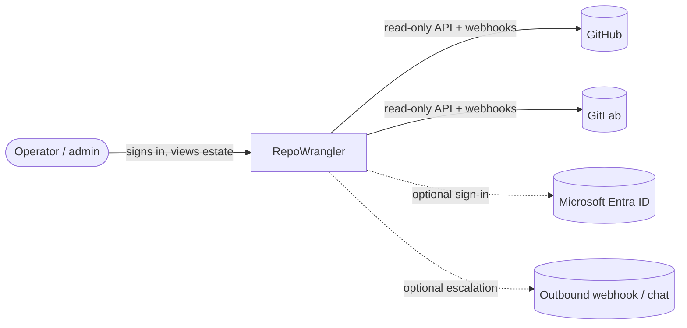
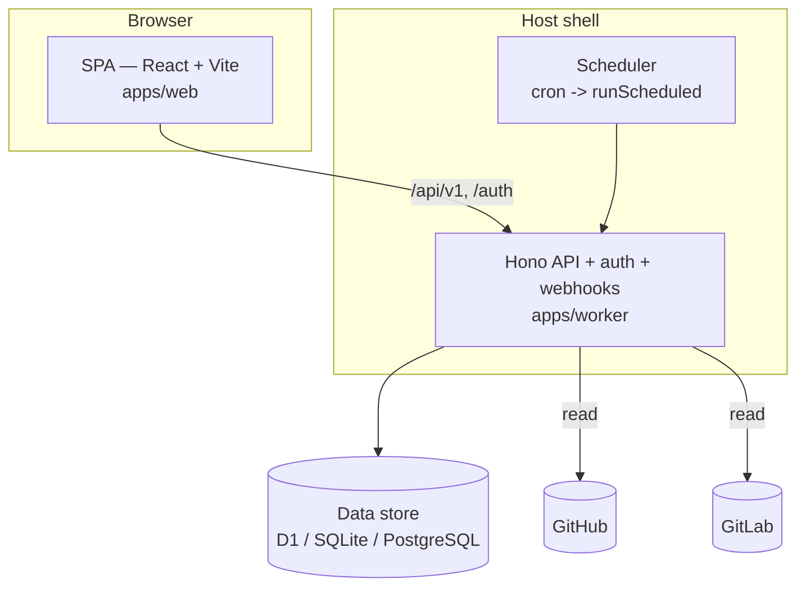
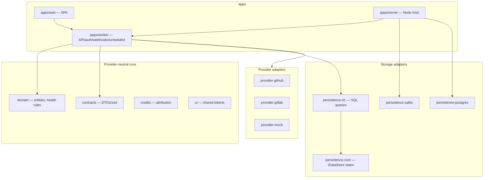

# Architecture

RepoWrangler is a single-tenant, read-only estate command center built as a
**provider-neutral core with swappable infrastructure adapters**. The domain,
API, and UI are written once; where it runs (Cloudflare, Node/Docker, Azure,
Kubernetes), what stores its data (D1, SQLite, PostgreSQL), and how people sign
in (GitHub, Entra) are all adapter choices behind stable seams. This is the
platform-neutrality commitment of [ADR-013](adr/ADR-013-platform-neutral-architecture.md).

## C4 level 1 — system context

RepoWrangler **reads** from providers and **never writes** to them
([ADR-003](adr/), [ADR-008](adr/)). It stores a normalized
snapshot of the estate and evaluates health locally.

## C4 level 2 — containers

The **same `apps/worker` Hono app** runs in two host shells:

- **Cloudflare Worker** — `apps/worker` deployed directly; D1 for storage,
  wrangler cron for the scheduler, the assets runtime for the SPA.
- **Node host** (`apps/server`, [ADR-014](adr/ADR-014-node-server-host.md)) —
  serves the same `app.fetch` via `@hono/node-server`, storage via the SQLite or
  PostgreSQL adapter, an in-process minute-tick scheduler, and static SPA serving.
  This is what the Docker, Azure Container Apps, and Kubernetes recipes run.

## C4 level 3 — components & packages

Key packages:

| Package | Responsibility |
|---|---|
| `apps/web` | React SPA (host-agnostic; `VITE_API_BASE_URL`, ADR-011). |
| `apps/worker` | Hono app: API (`/api/v1`), auth (`/auth`), webhooks, scheduled sync. |
| `apps/server` | Node host shell (SQLite/PostgreSQL) — zero Cloudflare. |
| `domain` | Provider-neutral entities and explainable health rules. |
| `contracts` | Shared DTOs / validation between API and SPA. |
| `provider-github` / `provider-gitlab` / `provider-mock` | Data-source adapters. |
| `persistence-core` | The storage seam (`IDataStore`). |
| `persistence-d1` | The SQLite/D1-dialect queries the API calls (~60 sites). |
| `persistence-sqlite` / `persistence-postgres` | D1-compatible adapters for the Node host. |
| `credits` | Open-source attribution surfaced in-product. |

## The three seams that make it portable

1. **Storage (PN-1).** The API calls `c.env.DB`, a D1-shaped handle. Cloudflare
   supplies real D1; the Node host supplies a D1-compatible object backed by
   SQLite ([ADR-014](adr/ADR-014-node-server-host.md)) or PostgreSQL
   ([ADR-015](adr/ADR-015-postgres-storage-adapter.md)). The persistence SQL is
   written once; PostgreSQL gets compatibility `datetime()` functions + a tiny
   translator so the **same `migrations/` and queries** run on both.
2. **Host (PN-2).** `apps/worker` re-exports `{ app, runScheduled }` and the `Env`
   type. Any host shell can drive the same app — Cloudflare does it natively;
   `apps/server` does it on Node.
3. **Auth (PN-5).** `AUTH_MODE` selects the sign-in provider (GitHub App or
   [Entra ID](adr/ADR-016-entra-id-authentication.md)); both issue the same signed
   session cookie, so everything downstream is identical.

## Data model & sync

- **Provider-neutral schema** with stable internal IDs, provider external IDs
  stored separately, freshness metadata on every record, and deletion modeled as
  a **state transition** (tombstones, never destructive deletes). See
  [`migrations/0001_initial.sql`](../migrations/0001_initial.sql).
- **Sync** is checkpointed and resumable: bounded, claimable `sync_jobs` are
  driven by the scheduler (`*/15 * * * *` incremental, `17 3 * * *` daily) and by
  **webhooks** for near-real-time updates, with idempotency by delivery ID
  ([ADR-006](adr/)).
- **Health** is evaluated locally by explainable rules in `domain`, producing a
  per-repository attention level with the findings that justify it.

## Deployment topologies

See the [deployment guide](deployment.md) for the full matrix and decision
flowchart. In short — three topologies (ADR-011): **Integrated** single-origin
(Cloudflare Worker, or the Node host serving its own SPA); **Decoupled** SPA
(GitHub Pages / Azure SWA) calling a separate API origin with CORS; **Self-hosted**
container (Docker / Azure Container Apps / Kubernetes) on SQLite or PostgreSQL.
Topology is independent of the deployment cost **tier** (Tier 0–3).

## Decision records

The full rationale lives in the [ADR index](adr/). Most relevant here:
ADR-004 (provider-neutral domain), ADR-005 (D1), ADR-011 (host-agnostic
frontend), ADR-013 (platform neutrality), ADR-014 (Node host), ADR-015
(PostgreSQL adapter), ADR-016 (Entra sign-in). The original design pack is under
[docs/design/](design/design-pack-index.md).
