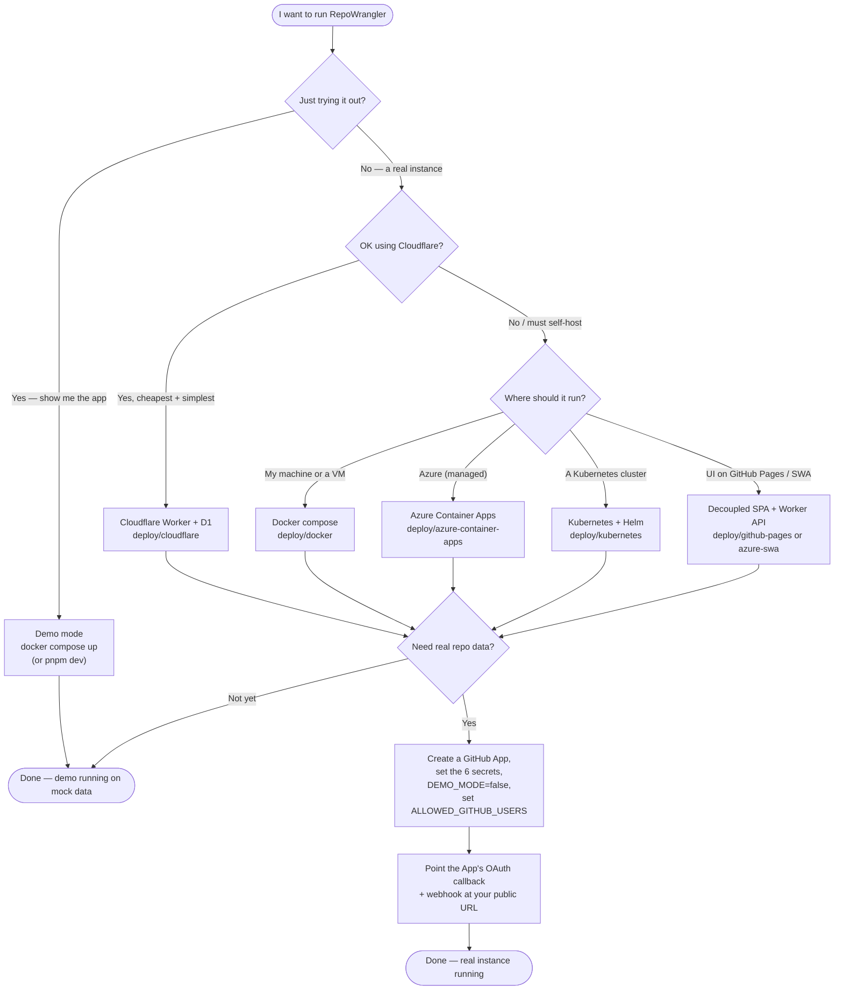

# Deploying RepoWrangler

RepoWrangler is platform-neutral (ADR-013): the same product runs on Cloudflare,
a self-hosted container, Azure, or Kubernetes. Every deployment runs in **demo
mode** first — mock data, no secrets — so you can see the whole app before wiring
anything up.

## Pick a target

| Target | Runs where | Backend | Best for | Recipe |
|---|---|---|---|---|
| **Cloudflare Worker** | Cloudflare edge | D1 | Zero-cost, zero-ops, integrated SPA+API | [`deploy/cloudflare/`](../deploy/cloudflare/) |
| **Docker / compose** | Any machine | SQLite | Home lab, a laptop, a VM — one command | [`deploy/docker/`](../deploy/docker/) |
| **Azure Container Apps** | Azure | SQLite on Azure Files | Managed serverless containers on Azure | [`deploy/azure-container-apps/`](../deploy/azure-container-apps/) |
| **Kubernetes** | Any cluster | SQLite on a PVC | AKS/EKS/GKE/k3s, GitOps shops | [`deploy/kubernetes/`](../deploy/kubernetes/) |
| **Decoupled SPA** | GitHub Pages / Azure SWA + Worker API | D1 | UI on a host you already use | [`deploy/github-pages/`](../deploy/github-pages/), [`deploy/azure-swa/`](../deploy/azure-swa/) |

All the self-hosted targets (Docker, Azure Container Apps, Kubernetes) run the
**same `apps/server` container** — the Node host that serves the SPA and API on
SQLite ([`apps/server/README.md`](../apps/server/README.md), ADR-014). They
differ only in the surrounding infrastructure: where the database volume lives,
where secrets come from, and how ingress is exposed.

## Capability matrix — features by platform

Read a capability down the left, a platform across the top; the cell tells you
how that platform delivers it. Use it to choose the target that fits your
constraints.

| Capability | Cloudflare Worker | Docker / compose | Azure Container Apps | Kubernetes | Decoupled SPA + Worker |
|---|---|---|---|---|---|
| **Cost floor** | Free tier | Your compute | ~a few $/mo | Cluster cost | Free tier |
| **Backend store** | D1 | SQLite (file) | SQLite on Azure Files, or PostgreSQL | SQLite on a PVC, or PostgreSQL | D1 |
| **No Cloudflare account** | ✗ required | ✅ | ✅ | ✅ | ✗ required |
| **Setup effort** | Lowest | Low | Medium | Medium–High | Medium |
| **Data survives redeploys** | ✅ D1 | ✅ volume | ✅ Azure Files | ✅ PVC | ✅ D1 |
| **Managed secrets** | CF secrets | `.env` | Key Vault (managed identity) | K8s Secret / ext-secrets | CF secrets |
| **Scheduler (sync cron)** | ✅ CF cron | ✅ in-process | ✅ in-process | ✅ in-process | ✅ CF cron |
| **Real-time webhooks** | ✅ | ✅ | ✅ | ✅ | ✅ |
| **Custom domain / TLS** | ✅ built-in | via your proxy | ✅ built-in | ✅ ingress | ✅ built-in |
| **Horizontal scale** | Edge-managed | 1 replica (SQLite) | ✅ with PostgreSQL \* | ✅ with PostgreSQL \* | Edge-managed |
| **Runs offline / air-gapped** | ✗ | ✅ | partial | ✅ | ✗ |
| **Recipe** | `deploy/cloudflare` | `deploy/docker` | `deploy/azure-container-apps` | `deploy/kubernetes` | `deploy/github-pages`, `deploy/azure-swa` |

\* SQLite is single-writer, so a SQLite deployment runs one replica. Set
`DATABASE_URL` to a shared **PostgreSQL** ([ADR-015](adr/ADR-015-postgres-storage-adapter.md))
to run multiple API replicas behind a load balancer — same container, no recipe
change; run the scheduler on exactly one replica (`ENABLE_SCHEDULER=false` on the
rest).

## Choose your deployment — decision flowchart

Start at the top and follow the answers to your recipe:

## The two-minute demo (any target)

- **Cloudflare:** `pnpm install && pnpm build && pnpm dev` → http://localhost:8787
- **Docker:** `docker compose up --build` → http://localhost:8080
- **Azure Container Apps:** `RESOURCE_GROUP=… ACR_NAME=… deploy/azure-container-apps/deploy.sh`
- **Kubernetes:** `kubectl apply -f deploy/kubernetes/manifests.yaml` (or the Helm chart)

Each serves mock data with no secrets. When you're ready for real data, follow
the recipe's "real mode" section.

## Going to real mode

Real mode needs a **GitHub App** (read-only — ADR-003) and a handful of secrets.
The flow is the same everywhere:

1. Create a GitHub App (each operator owns their own — design line 620). A
   personal-account app works even if you don't own an org; see
   [`deploy/cloudflare/README.md`](../deploy/cloudflare/README.md) for the manifest flow.
2. Set the six secrets — `GITHUB_APP_ID`, `GITHUB_APP_PRIVATE_KEY`,
   `GITHUB_WEBHOOK_SECRET`, `GITHUB_CLIENT_ID`, `GITHUB_CLIENT_SECRET`,
   `SESSION_SECRET` — where the target keeps secrets (Cloudflare `secret put`,
   `.env`, Key Vault, or a Kubernetes `Secret`).
3. Set `DEMO_MODE=false` and `ALLOWED_GITHUB_USERS` to your login (first to sign
   in becomes the owner).
4. Point the App's OAuth callback and webhook URL at your instance's public URL.

See [configuration.md](configuration.md) for every setting.

## Scale and roadmap

SQLite fits a single node — the self-hosted recipes pin one replica (SQLite is
single-writer) that also runs the scheduler. Horizontal scale wants a shared
database: the **Postgres adapter** (roadmap PN-1) slots in behind the same
`apps/server` host without changing any recipe. Entra ID sign-in (PN-5) is the
next auth provider. Track both in [ROADMAP.md](../ROADMAP.md).
