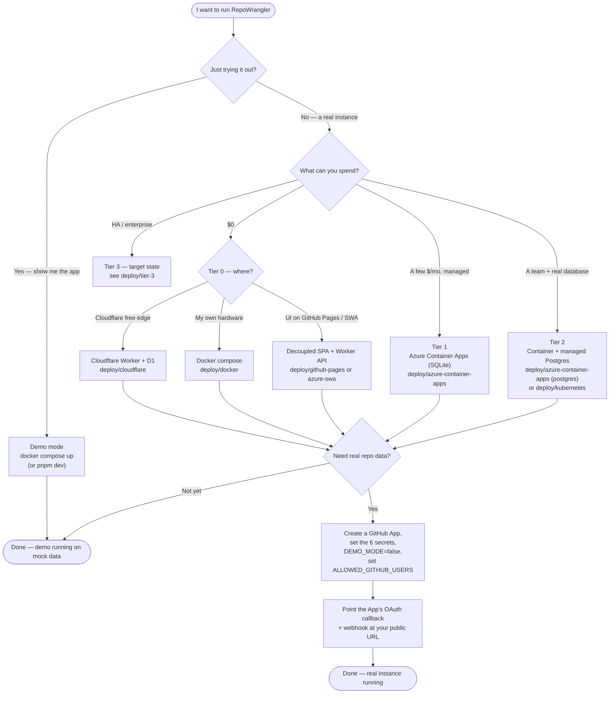

# Deploying RepoWrangler

RepoWrangler is platform-neutral (ADR-013): the same product runs on Cloudflare,
a self-hosted container, Azure, or Kubernetes. Every deployment runs in **demo
mode** first — mock data, no secrets — so you can see the whole app before wiring
anything up.

Deploying is a two-step choice: **pick a tier** (how much do you want to spend and
scale?), then **pick a recipe** within it (which host?).

## Pick a tier

Tiers sort by **cost and scale** — the thing most people decide first. Every tier
below Tier 3 uses recipes that already ship in [`../deploy/`](../deploy/).

| Tier | For | Cost | Backend | Recipes |
|---|---|---|---|---|
| **[Tier 0 — Free / self-run](deploy/tier-0)** | Trying it out, a home lab, or running it on hardware you already own | **$0** | D1 or SQLite | [`cloudflare`](../deploy/cloudflare/), [`docker`](../deploy/docker/), [`github-pages`](../deploy/github-pages/), [`azure-swa`](../deploy/azure-swa/) |
| **[Tier 1 — Low-cost / managed](deploy/tier-1)** | A small always-on instance you don't want to babysit | ~a few $/mo | SQLite on managed storage | [`azure-container-apps`](../deploy/azure-container-apps/) (SQLite) |
| **[Tier 2 — Team / scaled](deploy/tier-2)** | A team instance with a real database, backups, and room to scale | low $$/mo | managed PostgreSQL | [`azure-container-apps`](../deploy/azure-container-apps/) (Postgres), [`kubernetes`](../deploy/kubernetes/) |
| **[Tier 3 — Enterprise](deploy/tier-3)** | HA, private networking, SSO/RBAC, observability | varies | HA PostgreSQL | *target state — see the tier page* |

> **Free but self-run vs. free but managed.** Tier 0 holds two different $0 shapes:
> the **integrated** Cloudflare Worker (zero-ops, someone else's edge) and the
> **self-hosted** Docker container (your box, your uptime). Both cost nothing out
> of pocket. The decoupled options (GitHub Pages / Azure SWA + a Worker) are also
> free but split the UI from the API, so you maintain a CORS contract — more
> moving parts for the same $0.

## Topology

Independently of cost, a recipe runs in one of three **topologies** — how the
pieces are wired (ADR-011). This is orthogonal to the tier (**tier ≠ topology**):

| Topology | What runs where | Recipes |
|---|---|---|
| **Integrated** | One Cloudflare Worker serves the SPA **and** the API + D1 | `cloudflare` |
| **Decoupled** | SPA on a static host (GitHub Pages / Azure SWA / Cloudflare Pages); API on a Worker | `github-pages`, `azure-swa` |
| **Self-hosted** | One Node container serves the SPA **and** the API over SQLite/Postgres — no Cloudflare | `docker`, `azure-container-apps`, `kubernetes` |

All self-hosted recipes deploy the **same `apps/server` container**
([`apps/server/README.md`](../apps/server/README.md), ADR-014); they differ only
in the surrounding infrastructure — where the database volume lives, where
secrets come from, and how ingress is exposed.

## Capability matrix — features by platform

Read a capability down the left, a platform across the top; the cell tells you
how that platform delivers it.

| Capability | Cloudflare Worker | Docker / compose | Azure Container Apps | Kubernetes | Decoupled SPA + Worker |
|---|---|---|---|---|---|
| **Tier** | 0 | 0 | 1 (SQLite) · 2 (Postgres) | 2 | 0 |
| **Cost floor** | Free tier | Your compute | ~a few $/mo | Cluster cost | Free tier |
| **Backend store** | D1 | SQLite (file) | SQLite on Azure Files, or PostgreSQL | SQLite on a PVC, or PostgreSQL | D1 |
| **No Cloudflare account** | ✗ required | ✅ | ✅ | ✅ | ✗ required |
| **Setup effort** | Lowest | Low | Medium | Medium–High | Medium |
| **Data survives redeploys** | ✅ D1 | ✅ volume | ✅ Azure Files | ✅ PVC | ✅ D1 |
| **Managed secrets** | CF secrets | `.env` | Key Vault (managed identity) | K8s Secret / ext-secrets | CF secrets |
| **Scheduler (sync cron)** | ✅ CF cron | ✅ in-process | ✅ in-process | ✅ in-process | ✅ CF cron |
| **Real-time webhooks** | ✅ | ✅ | ✅ | ✅ | ✅ |
| **Custom domain / TLS** | ✅ built-in | via your proxy | ✅ built-in | ✅ ingress | ✅ built-in |
| **Horizontal scale** | Edge-managed | 1 replica (SQLite) | ✅ with PostgreSQL \* | ✅ with PostgreSQL \* | Edge-managed |
| **Runs offline / air-gapped** | ✗ | ✅ | partial | ✅ | ✗ |
| **Recipe** | `deploy/cloudflare` | `deploy/docker` | `deploy/azure-container-apps` | `deploy/kubernetes` | `deploy/github-pages`, `deploy/azure-swa` |

\* SQLite is single-writer, so a SQLite deployment runs one replica. Set
`DATABASE_URL` to a shared **PostgreSQL** ([ADR-015](adr/ADR-015-postgres-storage-adapter.md))
to run multiple API replicas behind a load balancer — same container, no recipe
change; run the scheduler on exactly one replica (`ENABLE_SCHEDULER=false` on the
rest). That Postgres step is what moves a self-hosted recipe from Tier 1 to Tier 2.

## Choose your deployment — decision flowchart

Start at the top and follow the answers to your tier and recipe:

## The two-minute demo (any target)

- **Cloudflare:** `pnpm install && pnpm build && pnpm dev` → http://localhost:8787
- **Docker:** `docker compose up --build` → http://localhost:8080
- **Azure Container Apps:** `RESOURCE_GROUP=… ACR_NAME=… deploy/azure-container-apps/deploy.sh`
  (or `deploy.ps1` on PowerShell)
- **Kubernetes:** `kubectl apply -f deploy/kubernetes/manifests.yaml` (or the Helm chart)

Each serves mock data with no secrets. When you're ready for real data, follow
the recipe's "real mode" section.

## Going to real mode

Real mode needs a **GitHub App** (read-only — ADR-003) and a handful of secrets.
The flow is the same everywhere, in every tier:

1. Create a GitHub App (each operator owns their own — design line 620). A
   personal-account app works even if you don't own an org; see
   [`deploy/cloudflare/README.md`](../deploy/cloudflare/README.md) for the manifest flow.
2. Set the six secrets — `GITHUB_APP_ID`, `GITHUB_APP_PRIVATE_KEY`,
   `GITHUB_WEBHOOK_SECRET`, `GITHUB_CLIENT_ID`, `GITHUB_CLIENT_SECRET`,
   `SESSION_SECRET` — where the target keeps secrets (Cloudflare `secret put`,
   `.env`, Key Vault, or a Kubernetes `Secret`).
3. Set `DEMO_MODE=false` and `ALLOWED_GITHUB_USERS` to your login (first to sign
   in becomes the owner).
4. Point the App's OAuth callback and webhook URL at your instance's public URL.

See [configuration.md](configuration.md) for every setting.

## Scale and roadmap

SQLite fits a single node — the Tier 0/1 self-hosted recipes pin one replica
(SQLite is single-writer) that also runs the scheduler. Scaling to a team wants a
shared database: the **Postgres adapter** ([ADR-015](adr/ADR-015-postgres-storage-adapter.md))
slots in behind the same `apps/server` host without changing any recipe — that's
the Tier 2 step. **Tier 3** (HA, separated controller/workers, private
networking, SSO/RBAC hardening, observability) is the enterprise target state;
its net-new pieces are tracked in [ROADMAP.md](../ROADMAP.md) and summarized on
the [Tier 3 page](deploy/tier-3).
