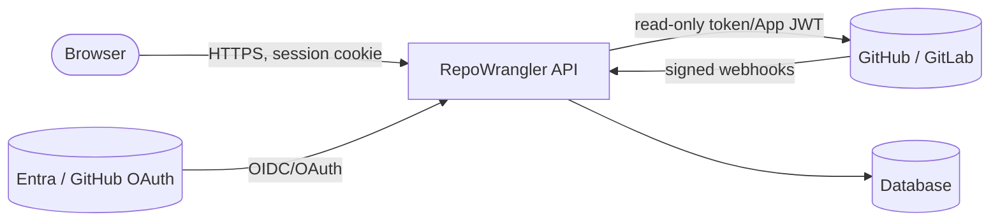

# Security

RepoWrangler is designed to be safe to point at a whole estate: it is read-only,
single-tenant, and holds no provider write capability. This page describes the
trust boundaries, how secrets are stored per target, and how to report a
vulnerability.

## Core guarantees

- **Read-only against providers** ([ADR-003](adr/),
  [ADR-008](adr/)). RepoWrangler requests no write scopes and performs no
  write actions on GitHub or GitLab. The worst case for a compromised instance is
  disclosure of the metadata it already stores — not modification of your repos.
- **Single-tenant** ([ADR-010](adr/)). Each operator runs their own
  instance with their own credentials; there is no shared multi-tenant surface.
- **No secret values in the repo.** The codebase contains only placeholders and
  config *names*. Real values live in your platform's secret store.
- **No code or secret material stored.** Security findings are stored as redacted
  summaries only — never secret values or code snippets (see
  [`migrations/0001_initial.sql`](../migrations/0001_initial.sql)).

## Trust boundaries

- **Browser ↔ API:** HttpOnly, `SameSite=Lax`, `Secure` session cookie signed
  with `SESSION_SECRET` (HMAC-SHA-256). The browser never receives provider token
  material. Baseline security headers (CSP, `X-Content-Type-Options`,
  `Referrer-Policy`, `Permissions-Policy`) are set on every response.
- **API ↔ providers:** short-lived GitHub App installation tokens / a read-scoped
  GitLab token, over TLS. Tokens are used server-side and never sent to the client.
- **Providers ↔ API (webhooks):** every inbound webhook signature is verified
  (`GITHUB_WEBHOOK_SECRET` / `GITLAB_WEBHOOK_SECRET`) and deduplicated by delivery
  ID for idempotency.
- **Sign-in:** GitHub user-authorization or Entra OIDC; access is gated by an
  explicit allowlist. Sign-in and denial events are audited.

## Secret storage per target

Anything marked *secret* in [configuration.md](configuration.md) must come from a
secret store, never a committed file:

| Target | Secret store |
|---|---|
| Cloudflare | `wrangler secret put` (encrypted at rest; not in `wrangler.jsonc`). |
| Docker / compose | An un-committed `.env` with restricted file permissions. |
| Azure Container Apps | **Azure Key Vault** referenced by the app's **managed identity** (no secret in config). |
| Kubernetes | A `Secret` (ideally via external-secrets / sealed-secrets), mounted as env. |
| Decoupled SPA | None — the SPA holds no secrets; it only calls the API. |

Rotate `SESSION_SECRET`, provider secrets, and the Entra client secret per your
policy. Rotating `SESSION_SECRET` invalidates existing sessions (users re-sign-in).
See [rotate-github-app-key](operations/rotate-github-app-key.md).

## Access control

- Allowlists: `ALLOWED_GITHUB_USERS` / `ENTRA_ALLOWED_USERS`. The first to sign in
  is the **owner**; others are **admins**; roles gate mutating admin endpoints.
- CORS is deny-by-default: cross-origin API access is granted only to exact origins
  in `CORS_ALLOWED_ORIGINS` (empty = same-origin only).

## Hardening checklist for a real deployment

- [ ] `DEMO_MODE=false` and a strong, unique `SESSION_SECRET`.
- [ ] Secrets in a real secret store; `.env`/config files un-committed.
- [ ] `PUBLIC_BASE_URL` on HTTPS; TLS terminated by your host/ingress.
- [ ] Webhook secrets set and webhook URLs restricted to provider IPs where
      possible.
- [ ] Allowlist limited to the people who need access.
- [ ] Database backups configured and tested ([operations.md](operations.md)).
- [ ] For PostgreSQL, `sslmode=require` (or stricter) in `DATABASE_URL`.

## Reporting a vulnerability

Please follow [SECURITY.md](../SECURITY.md) for private disclosure. Do not open a
public issue for a security report.
